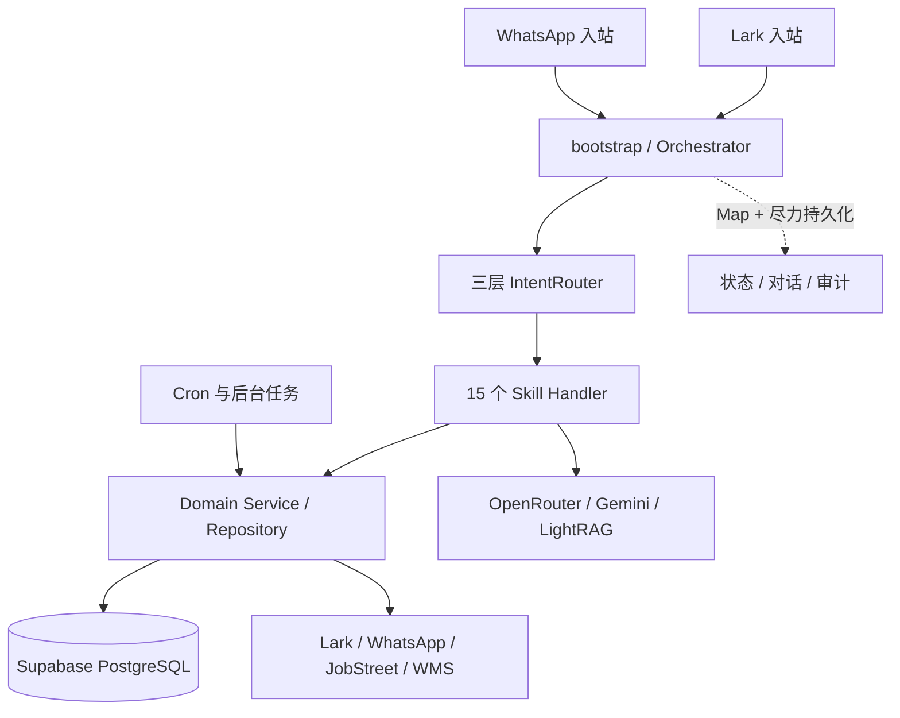
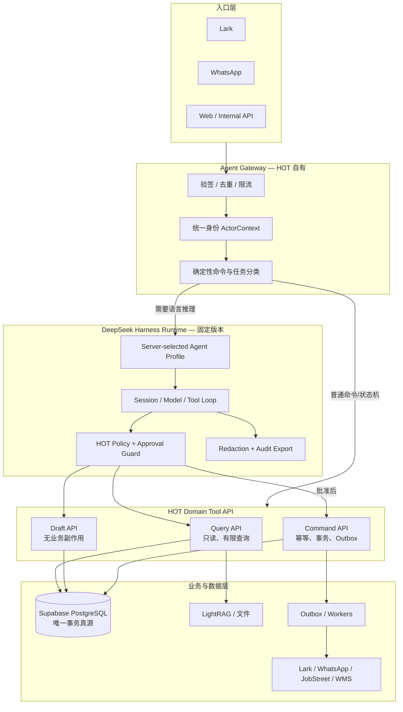
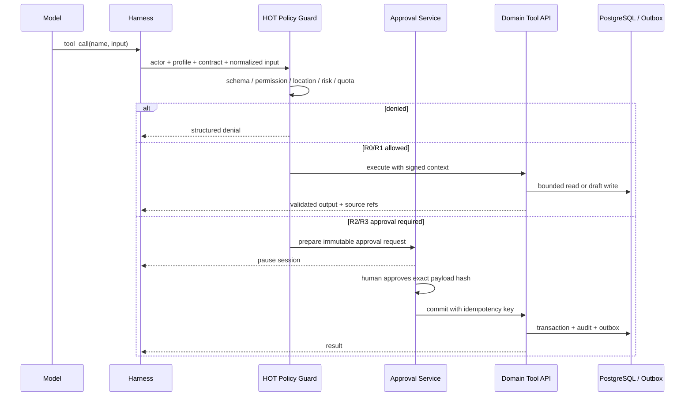

# HOT CRUSH DeepSeek Harness 企业 Agent 平台设计

> 状态：设计评审稿，未实施<br>
> 基线日期：2026-08-16<br>
> 代码基线：`98579c6` 及其父提交中的 HOT 业务代码<br>
> 边界：本文件不授权数据库 DDL/DML、依赖安装、外部发布或生产部署。

## 1. 结论

HOT CRUSH 适合采用 DeepSeek Harness，但不适合把现有系统整体改写成“多 Agent 自主协作平台”。
当前最优解是：

1. **保留 Supabase PostgreSQL 为唯一 OLTP 事务真源**，不因采用 Harness 迁移数据库，也不把 Fabric 设为前置依赖；
2. **最大化复用 Harness 的运行循环、Profile/Bundle、工具管线、会话事件和审批扩展点**，但不继承其面向编码 Agent 的 Bash、文件系统、子 Agent 等默认能力；
3. **保留现有 15 个 Skill 背后的业务逻辑**，先拆成只读 Query、草稿 Draft、写入 Command、外部发布 Publish 和确定性 Worker，再通过窄工具契约接入 Harness；
4. **先上线单 Agent、只读、可回退的营运场景**，证明身份、权限、数字来源、日志脱敏和稳定性以后，再开放草稿与写操作；
5. **不让模型直接访问 SQL、数据库凭据、Shell、任意网络或消息发送接口**。模型只能提出结构化工具调用，平台负责身份、权限、审批、幂等、事务和审计。

Harness 是控制层，不是数据库、数仓、权限系统或业务规则本身。采用 Harness 不能自动解决 HOT 当前的权限失效、审计尽力而为、原始 Prompt 落库和定时任务混部等问题；这些仍需要 HOT 自己实现企业插件和服务边界。

## 2. 前提检查

### 2.1 已确认事实

- `bakery-ops/src/modules/skills/index.ts` 当前注册 15 个 Skill；
- `IntentRouter` 已有关键词、Embedding、LLM 三层意图路由；
- `Orchestrator` 已处理多轮状态、招聘候选人入口、渠道身份和审计；
- Lark、WhatsApp、HTTP/Next.js、定时任务当前由同一个启动过程组合，依靠 `INSTANCE_ROLE` 做部分拆分；
- 数据访问已经散布在 Skill、Repository、Service 和脚本中，部分 Skill 会直接写业务状态；
- `SkillDefinition.permissions`、`riskLevel` 和 `requiresConfirmation` 已声明，但没有形成统一、不可绕过的运行时管线；
- 当前部门权限在身份无法解析时存在观察模式或放行路径，不满足企业写操作的 fail-closed 要求；
- 当前 AI Provider 会把完整 Prompt 和响应写入 `ai_call_log`，其中可能包含员工、简历、电话和经营数据；
- 当前生产数据库已被多个代码库与部署目标使用，因此“Agent 尚未落地”不等于“现有功能和数据可以随意推倒重来”。

### 2.2 合理推断

- HOT 的首要问题不是缺少更多 Agent，而是缺少统一的身份上下文、工具权限、审批、幂等和可验证数字来源；
- 当前 15 个 Skill 已经构成一个轻量自研 Harness，迁移价值主要来自标准化控制面，而不是重新编写业务能力；
- 团队科研能力有限时，减少自主规划、Agent 间委派和自由工具组合，会比追求“智能涌现”更可靠、更省维护成本。

### 2.3 暂无法验证

- DeepSeek Harness 在 HOT 真实并发量、长时间运行和故障恢复下的稳定性；
- Harness 后续候选版本的 API 兼容性和升级节奏；
- DeepSeek 模型是否适合所有中英马来语混合、招聘 PII 和营运推理场景；
- 迁移后路由准确率、延迟和单次对话成本。

这些必须通过固定版本、影子流量和评测集验证，不能从 README 或演示直接推出。

## 3. 当前代码的真实结构



它已经能工作，但控制权分散：

| 当前事实 | 后果 |
|---|---|
| Skill 自己调用 Repository、外部服务或文件系统 | 中央层无法保证每个副作用都经过同一权限和审批 |
| `permissions` 只存在于定义中，Orchestrator 主要检查部门映射 | 声明不等于执行，新增 Skill 容易漏授权 |
| 多个写操作仍标为 `low` 且无需确认 | 风险标签和真实副作用不一致 |
| 状态、对话、审计多为内存加异步尽力写入 | 进程崩溃时可能丢失关键证据 |
| 原始 Prompt/响应落库 | HR PII、经营机密和第三方模型输入存在过度留存风险 |
| Web、渠道、Agent、Cron 混在同一启动链 | 故障域、扩缩容和发布回滚互相牵连 |

## 4. 15 个现有 Skill 的目标处置

“保留”指保留业务规则和测试，不代表保留当前 Handler 作为最终权限边界。

| 当前 Skill | 当前真实行为 | 目标拆分 | 首期处置 |
|---|---|---|---|
| `help` | 展示功能清单 | 网关本地命令 | 不进模型循环 |
| `system_status` | 查看系统状态 | `system.get_status` Query | 管理员只读 |
| `daily_review_chat` | 查经营数据，也写店长原文与洞察 | `ops.get_daily_facts` Query + `ops.save_manager_review` Command | 先只读；写入后开 |
| `forecast_order` | 查询销量/预估/复盘，部分生成预测 | `forecast.get_context` Query + `forecast.prepare_draft` Draft | 第二阶段 |
| `forecast_review` | 查询预测与实销差异 | `forecast.get_review` Query | 首期可用 |
| `kitchen_production_plan` | 生成生产计划 | `production.prepare_plan` Draft | 只生成草稿，不执行排产 |
| `wms_stock` | 查询库存 | `inventory.get_stock` Query | 首期可用 |
| `knowledge_query` | RAG/知识查询 | `knowledge.search` Query | 首期可用，必须带来源 |
| `active_jobs` | 查询招聘岗位 | `hr.list_active_jobs` Query | HR Profile 只读 |
| `recruitment_progress` | 查询招聘进展 | `hr.get_recruitment_progress` Query | HR Profile 只读 |
| `backup_pool` | 查询候选人备选池 | `hr.list_backup_candidates` Query | HR 敏感只读、字段脱敏 |
| `recruitment_sourcing` | 外部搜索、筛选、下载候选人资料 | `hr.prepare_sourcing_job` Draft + Worker | 不让 Agent 直接爬取或下载 |
| `resume_upload` | 解析简历并创建/更新员工、同步 Lark | `hr.parse_resume` Draft + `hr.commit_candidate` Command | 先解析到暂存，写入需审批 |
| `employee_management` | 解析自然语言并改变员工事件/状态 | `hr.prepare_employee_change` Draft + `hr.commit_employee_change` Command | 高风险，最后迁移 |
| `job_posting` | 生成并向 JobStreet 等外部平台发布 | `hr.prepare_job_posting` Draft + `hr.publish_job` Publish | 发布必须显式审批 |

另有三类逻辑不应包装成 Agent Skill：

- 候选人回复码、面试/试岗等确定性状态机；
- 每日复盘、补货、招聘提醒、消息发送队列等 Cron/Worker；
- 取消、帮助、健康检查、Webhook 验签、幂等去重等协议逻辑。

## 5. 目标架构

从业务能力往下看，金字塔应当是：

```text
                    ┌──────────────────────┐
                    │ Lark / WA / Web 体验 │
                 ┌──┴──────────────────────┴──┐
                 │ 任务 Profile：营运/生产/HR │
              ┌──┴────────────────────────────┴──┐
              │ Harness：会话/模型/工具/审批管线 │
           ┌──┴──────────────────────────────────┴──┐
           │ Domain API + 状态机 + Worker + Outbox │
        ┌──┴────────────────────────────────────────┴──┐
        │ PostgreSQL 事务真源 + 受控文件/RAG + 审计证据 │
        └───────────────────────────────────────────────┘
```

身份、权限、数据分类、可观测性和版本治理不是单独一层，而是从入口贯穿到数据层的纵向护栏。



这不是要求立即拆成多个微服务。第一阶段可以仍部署在同一个代码库，先用模块和接口建立边界；只有并发、故障域或独立发布确有证据时才拆进程。

### 5.1 四个所有权边界

| 组件 | 负责 | 明确不负责 |
|---|---|---|
| Agent Gateway | 渠道验签、消息去重、身份解析、会话键、Profile 选择、快速命令 | 业务写入、模型自由决策 |
| Harness Runtime | 模型循环、结构化工具调用、会话事件、审批暂停/恢复 | 裸 SQL、直接消息发送、用户身份推断 |
| Domain Tool API | 类型化业务能力、事务、幂等、数据范围、来源 | 自主规划、自然语言权限判断 |
| Workers | Cron、Outbox、重试、外部同步、确定性状态机 | 根据模型自由改变任务目标 |

### 5.2 首期物理部署

- 在 `tokyo-01` 上把 Harness 作为独立、仅监听 localhost 的进程运行，先不放到 Vercel 等临时文件系统环境；
- Lark/WhatsApp 现有进程通过带服务身份和 trace id 的内部请求访问 Harness；
- Harness 进程可导入现有 Domain Service 的适配层，但不得导入渠道发送器或获得通用数据库执行器；
- 会话目录放在受控持久卷并加密、备份、设置保留期；本地 SQLite/JSONL 模式下必须保持会话到实例的稳定路由；
- 旧 Orchestrator 继续在线作为整会话回退路径，Harness 故障不影响确定性 Cron、状态机和 Outbox；
- 初期同一台 VM 仍是单机故障域，这是有意接受的简化。只有实际可用性或容量证据出现后才扩为多实例和远程 Session Provider。

## 6. DeepSeek Harness 的使用方式

截至基线日，官方仓库仍将项目标为 developer preview，当前包版本为 `0.1.0-rc.5`。官方架构强调“一切皆插件”、Profile/Bundle 组合、追加式会话事件与可扩展工具执行管线。因此采用方式应是**锁版本 + 外置插件 + 不 fork**。

官方依据：

- [DeepSeek Harness 仓库](https://github.com/deepseek-ai/deepseek-harness)
- [架构与 Profile/Bundle](https://github.com/deepseek-ai/deepseek-harness/blob/master/docs/architecture.md)
- [工具执行管线](https://github.com/deepseek-ai/deepseek-harness/blob/master/docs/tool-execution-pipeline.md)
- [Agent 生命周期](https://github.com/deepseek-ai/deepseek-harness/blob/master/docs/agent-lifecycle.md)
- [Base Bundle 默认配置](https://github.com/deepseek-ai/deepseek-harness/blob/master/packages/bundle/base/cordis.patch.yml)
- [Session Telemetry 与脱敏边界](https://github.com/deepseek-ai/deepseek-harness/blob/master/packages/session/session-telemetry/README.md)

### 6.1 复用与禁用清单

| Harness 能力 | HOT 处置 | 原因 |
|---|---|---|
| Session / turn / tool 追加事件 | 复用 | 形成可恢复、可追踪的模型上下文 |
| Model adapter / retry | 复用并包一层 HOT model policy | 保留 DeepSeek/OpenRouter 等可替换性 |
| Tool registry / pre-execute / post-execute | 复用 | 是中央权限、审批、审计的正确卡点 |
| Approval seam | 复用暂停/恢复机制 | 业务审批规则由 HOT 插件定义 |
| Profile / Bundle | 复用 | 按场景最小授权，不让模型选权限 |
| JSONL/SQLite session persistence | 只作单实例运行日志 | SQLite 会阻塞事件循环，也不是企业中央真源 |
| Session telemetry | 默认关闭 | 官方实现不自带 HOT 所需的 PII 脱敏规则 |
| Bash / subprocess / filesystem write | 生产禁用 | 餐饮营运 Agent 无正当需要 |
| Web / 任意网络 | 生产禁用 | 网络策略不是文件 Sandbox 能完整约束的 |
| Subagent / 自由委派 | 首期禁用 | 增加成本、权限传播与调试复杂度，没有业务必要性证据 |
| Coding-agent 示例 Profile | 不作为生产基线 | 面向开发机，不是企业业务 Agent |

### 6.2 版本策略

- 锁定完整 Git commit SHA 和包锁文件，禁止使用浮动 `main`、`master` 或宽松 semver；
- 官方根包当前要求 Node `^22.19.0 || >=24.0.0`；本地为 `v24.4.1`，满足要求，但实施前仍须单独核对 tokyo-01 运行时，不能用开发机版本代替生产证据；
- HOT 插件放在本仓库或独立私有包中，不修改 Harness 源码；
- 每次升级先跑契约测试、评测集、影子流量，再改变生产 Profile；
- 保留上一版 Bundle 和依赖锁，Profile 切换即可回滚；
- Base Bundle 的数组/配置 patch 可能是整段替换语义，升级时必须比较最终解析后的 Profile，而不只看 YAML diff。

### 6.3 建议的代码边界（实施后）

```text
bakery-ops/src/agent-platform/
  gateway/                 # Lark/WA/Web 统一入口和 ActorContext
  profiles/                # ops-readonly / production-draft / hr-coordinator
  harness/
    hot-bundle/            # 生产最小 Bundle
    hot-context-plugin/    # 身份、门店、渠道、会话上下文
    hot-policy-plugin/     # 权限、风险、审批、配额、数据分类
    hot-domain-tools/      # 仅注册 HOT 类型化工具
    hot-audit-plugin/      # 脱敏、run/tool manifest、指标
  domain-tools/
    ops/
    forecast/
    production/
    inventory/
    hr/
    knowledge/
  workers/                 # Cron、Outbox、外部平台连接器
```

这是目标目录，不是本轮创建任务。初期不要为了目录好看迁移所有现有文件；按接入的 Tool 逐个搬边界。

## 7. 身份与 Profile 选择

### 7.1 统一 ActorContext

网关解析身份，Harness 和模型只能接收已签发的上下文，不能自行根据名字、手机号或聊天内容猜身份。

```ts
interface ActorContext {
  userId: string;
  channel: "lark" | "whatsapp" | "web" | "system";
  channelIdentityId: string;
  roles: string[];
  permissions: string[];
  locationIds: string[];
  locale: "zh-CN" | "en-MY" | "ms-MY";
  authStrength: "channel_verified" | "web_session" | "service_identity";
  issuedAt: string;
  expiresAt: string;
}
```

硬规则：

- 身份未解析：只能使用帮助和公开状态，不得访问业务数据；
- 门店范围未解析：不得默认“全部门店”；
- HR Profile 只能由 HR/老板角色在受控渠道选择；
- Profile 由服务端根据身份与任务选择，模型无权升级 Profile；
- `system` 身份只能运行白名单 Worker 工具，不能模拟真人审批。

### 7.2 首期三个 Profile，不建设多 Agent 群

| Profile | 可见工具 | 数据范围 | 写权限 | 上线顺序 |
|---|---|---|---|---|
| `hc-ops-readonly` | 日报、预测复盘、库存、知识查询 | actor 的门店范围 | 无 | 第一 |
| `hc-production-draft` | ops 只读 + 预测草稿 + 生产计划草稿 | actor 的门店范围 | 仅保存可丢弃草稿 | 第二 |
| `hc-hr-coordinator` | 招聘只读、简历解析、JD 草稿 | HR 授权范围 | 默认无；命令工具后开 | 第三 |

所谓 `ops analyst`、`production planner`、`hr coordinator` 首期只是不同的 Profile/Prompt/工具集合，而不是三个互相聊天、自由委派的自治进程。

## 8. 工具契约与风险模型

### 8.1 每个工具必须声明

```ts
interface HotToolContract<Input, Output> {
  code: string;
  version: string;
  ownerDomain: "ops" | "forecast" | "production" | "inventory" | "hr" | "knowledge" | "system";
  effect: "query" | "draft" | "command" | "publish";
  risk: "R0" | "R1" | "R2" | "R3" | "R4";
  dataClasses: Array<"public" | "internal" | "financial" | "employee_pii" | "candidate_pii">;
  requiredPermissions: string[];
  approval: "never" | "policy" | "always" | "two_person";
  idempotency: "none" | "required";
  inputSchema: unknown;
  outputSchema: unknown;
  timeoutMs: number;
  maxRows?: number;
}
```

输入输出使用 Zod/JSON Schema 双向验证。工具只能返回 JSON-safe 的有限结果，并携带 `sourceRefs`、`asOf`、单位和时区；最终自然语言中的数字必须能追溯到工具输出。

### 8.2 风险等级

| 级别 | 含义 | HOT 示例 | 默认策略 |
|---|---|---|---|
| R0 | 只读、低敏、有限结果 | 门店库存、预测复盘 | 权限通过即可执行 |
| R1 | 可丢弃草稿或内部计算 | 预测草稿、生产计划草稿、JD 草稿 | 允许保存草稿，不改变正式状态 |
| R2 | 内部正式写入或敏感资料落库 | 保存店长复盘、创建候选人 | 显式确认、幂等、事务审计 |
| R3 | 人员状态、对外发布或对外消息 | 离职/录用、发布职位、发 WhatsApp | 每次审批，审批后异步执行 |
| R4 | 钱、权限、删除、不可逆批量操作 | 付款、提权、批量删除 | Agent 不执行，只生成操作单 |

### 8.3 首批工具目录

第一批只实现四个 R0 工具：

1. `ops.get_daily_facts`
2. `forecast.get_review`
3. `inventory.get_stock`
4. `knowledge.search`

它们共同满足：只读事务、固定 SQL/Repository、有限行数、显式门店范围、来源时间、无原始数据库错误回传模型。`help` 和 `system_status` 仍由网关直接响应，不消耗模型调用。

第二批再实现：

- `forecast.prepare_draft`
- `production.prepare_plan`
- `hr.prepare_job_posting`
- `hr.parse_resume`

R2/R3 工具在审批、事务审计和 Outbox 通过验收前不得注册进任何生产 Profile。隐藏在 Prompt 中不算禁用；必须从 Tool Registry 移除。

`hr.commit_employee_change` 在真正实施时还必须继续拆小：入职、资料更正、离职登记、解雇和权限变更不是同一风险。解雇、提权和批量人员变更不得由一个通用自然语言工具直接执行；至少进入双人审批或只生成线下操作单。

## 9. 不可绕过的执行管线

每次工具调用必须按相同顺序执行：



关键约束：

- 审批绑定 `actor + tool code/version + normalized input hash + target + expiry`；任何字段变化都使审批失效；
- “用户刚才大概同意了”不是审批；必须由审批服务产生明确记录；
- R2/R3 的业务变更、审计和 Outbox 在同一数据库事务中完成；
- 外部发布由 Worker 消费 Outbox，Agent 不直接调用 JobStreet/Lark/WhatsApp；
- 所有命令工具要求客户端或平台生成幂等键；重试不得重复入职、发布或发消息；
- 权限服务异常、身份缺失、审批无法回答时 fail closed；
- 模型拒绝、超时或崩溃不得自动降级成绕过工具的脚本执行。

## 10. 数据、会话、审计与 PII

### 10.1 三种“真相”不能混在一起

| 类型 | 权威来源 | 用途 |
|---|---|---|
| 业务事实 | PostgreSQL 正式业务表 | 员工状态、库存、预测、招聘、复盘 |
| Agent 运行事实 | Harness append-only session events | 模型消息、工具请求、暂停/恢复、结果顺序 |
| 企业审计事实 | PostgreSQL 审计/审批/工具执行索引 | 谁在何时以何权限批准并执行了什么 |

Harness JSONL/SQLite 不替代业务数据库；数据库聊天记录也不应被拼成 Harness 的第二套模型上下文。

### 10.2 最小落库策略

- R0 影子和只读阶段不新增业务表，先使用隔离、加密、有限保留期的 Harness session log；
- 进入 R2/R3 前，落实上一份平台设计中的 `ai_run`、`ai_tool_execution`、`ai_approval`、`ai_session_log_manifest`，以及发布/策略版本记录；
- 不把每个 token 或完整会话重复写入 PostgreSQL，数据库保存索引、摘要、哈希和密封日志位置；
- 现有 `ops_audit_log` 可作为过渡观测，不可作为高风险命令的唯一证据，因为当前写失败会被吞掉；
- `ai_call_log` 改为默认只保留模型、延迟、token、成本、状态、trace id 和经过批准的摘要；原始 Prompt/响应默认不落库。

### 10.3 PII 与模型路由

- HR 数据在送入模型前做字段最小化；能用候选人 ID 就不传手机号/身份证/住址；
- 简历原文件留在受控存储，模型只接收任务所需文本片段；
- `hr.parse_resume` 的解析结果若只在短期加密暂存中存在可视为 Draft；一旦写入正式候选人/员工记录，就升级为 R2 Command；
- Prompt、工具输出、异常、遥测和开发日志使用同一脱敏器；
- Session telemetry 在脱敏插件和泄漏测试通过前保持关闭；
- 每个数据分类维护允许的模型供应商和区域，HR PII 不允许自动 fallback 到未批准供应商；
- 记录实际命中的 provider/model，而不仅是请求的逻辑模型名；
- RAG 回答必须返回来源 ID/文档版本；没有来源时明确回答“没有可验证依据”。

## 11. 渠道、状态机与 Worker

### 11.1 渠道适配器保留

现有 Lark/WhatsApp 适配器可以保留，但只负责：

1. 验证平台事件；
2. 生成稳定 `messageId` 并去重；
3. 将渠道身份映射为 `ActorContext`；
4. 把文本/附件归一化为网关请求；
5. 将平台响应渲染为渠道格式。

渠道适配器不得自己拥有业务权限逻辑；手机号只是映射属性，不应继续充当全局主身份。

### 11.2 确定性优先于 Agent

以下流程继续使用代码状态机：

- 候选人回复、面试确认、试岗和 Offer 状态迁移；
- 定时数据拉取、日报、提醒、超时重试；
- WhatsApp 每日上限、营业时间、opt-out 和抖动策略；
- Lark 组织同步、消息 Outbox 和外部平台回执。

Agent 可以解释或准备下一步，但不能替代这些确定性规则。这样既降低 token 成本，也防止同一输入因模型随机性导致不同业务状态。

## 12. 迁移路线

### Phase 0：冻结现状，不改生产行为

- 为 15 个 Skill 建立输入、输出、数据库副作用和外部副作用清单；
- 把现有关键对话匿名化为评测集；
- 为当前 Orchestrator 路由和四个首批只读能力补特征测试；
- 记录现有延迟、成功率、路由结果和人工纠正，作为基准。

退出门禁：当前测试全绿；每个 Skill 的真实副作用有所有者；无“标低风险但未知写入”的能力。

### Phase 1：引入 Harness，但只跑影子路由

- 锁定 Harness commit；
- 创建最小 HOT Bundle，明确移除 Bash、FS write、Web、Subagent；
- Harness 路径先改用 `HotModelGateway`，不得沿用当前会记录完整 Prompt/响应的全局 Provider 行为；
- 网关把允许用户的消息同时送给旧 Router 和 Harness，Harness 结果不回复、不执行工具；
- 比较意图、工具选择、参数、延迟和成本。

退出门禁：影子运行不会写库/发消息；结果可按 `messageId` 对比；出现异常可停用而不影响旧系统。

### Phase 2：`hc-ops-readonly` 小流量

- 接入四个 R0 Tool；
- 按用户 allowlist 或稳定哈希分流；
- 旧 Orchestrator 保持同会话级回退，不做单轮随机切换；
- 输出必须显示数据日期、门店范围和来源。

退出门禁：越权查询和未授权 Tool 100% 被阻断；数字来源断言全通过；PII 泄漏用例为 0；现有生产功能回归全绿。

### Phase 3：草稿能力

- 加入预测和生产计划 Draft；
- 草稿与正式表/状态分离；
- 人工从现有页面确认采用，Agent 不直接提交正式业务状态。

退出门禁：同一输入可重试且不产生重复正式记录；草稿失败不影响现有流程。

### Phase 4：HR 敏感只读与解析

- 上线 HR 专用 Profile、字段脱敏和供应商路由；
- 简历解析结果进入暂存区，不自动创建员工；
- 对抗 Prompt injection、附件伪指令和跨候选人数据泄漏。

退出门禁：非 HR 身份无法发现 HR Tool；日志、错误和遥测无原始 PII；解析结果需人工确认。

### Phase 5：R2/R3 Command

- 建立审批、幂等、事务审计、Outbox 和密封 session manifest；
- 先开放保存店长复盘，再开放候选人写入；
- 员工状态变更、职位发布和外部消息最后开放。

退出门禁：审批 payload 被修改必失效；进程在任意步骤崩溃可安全重试；数据库事实、审计和外部回执可串成同一 trace。

### Phase 6：是否拆服务、是否接 Fabric

只有出现可测量的独立扩缩容、故障隔离或分析需求时才评估。Fabric 若将来启用，只读取 PostgreSQL 的业务事实和 Agent 审计做分析，不进入 Agent 在线事务链。

## 13. 测试与发布门禁

### 13.1 必须自动化的测试

- Profile 最小能力快照：生产 Profile 不出现 Bash、FS、Web、Subagent；
- Tool schema 契约：非法字段、越界日期、空门店、超行数全部拒绝；
- 身份/权限矩阵：角色 × 门店 × 渠道 × 工具；
- 审批状态机：批准、拒绝、过期、payload 变更、重复回调；
- 幂等与崩溃恢复：请求前、事务中、Outbox 后、回执前分别注入故障；
- Prompt injection：用户文本、简历、知识库文档不得改变 Tool/权限规则；
- 数字忠实性：回复中的日期、金额、数量都能在 Tool 输出找到；
- PII 泄漏：Prompt、响应、trace、错误、遥测和 session export；
- 旧功能回归：Lark、WhatsApp、招聘状态机、定时任务和当前 Vitest 套件；
- 版本回归：Harness、Bundle、Prompt 或模型任一变化都重跑固定评测集。

### 13.2 发布与回滚

- 发布单元是 `Harness commit + HOT bundle hash + profile version + prompt version + model route policy`；
- 每次会话固定一个发布版本，不在中途换 Profile；
- 分流以会话或用户稳定哈希为单位；
- 回滚只切回旧发布/Profile 或旧 Orchestrator，不做数据库反向迁移；
- 新命令采用 expand/contract 数据迁移，旧消费者未验证前不删除字段/视图；
- Harness 不健康时只读请求可回旧 Orchestrator；写请求不得静默降级成无审批旧路径。

## 14. 第一阶段的明确非目标

- 不迁移 Supabase；
- 不启用 Fabric；
- 不构建通用低代码 Agent Builder；
- 不支持任意 SQL、任意 Python/Bash 或任意 URL；
- 不做多 Agent 自由协作；
- 不让模型直接改员工状态、发布岗位或发外部消息；
- 不一次性重写 15 个 Skill；
- 不为了“企业级”提前拆微服务或新建大量空表。

## 15. 建议的首个实施增量

只做一条可验证的竖切：**Lark/WhatsApp 用户问库存或预测复盘 → Gateway 解析身份 → `hc-ops-readonly` → 一个有限 Query Tool → 带日期与来源的回答**。

成功标准：

1. 不改变任何现有业务表；
2. 旧入口和旧 Orchestrator 可一键回退；
3. 未授权用户和跨门店查询全部拒绝；
4. 模型不可见数据库凭据、SQL、Shell、文件写入和外部发布工具；
5. 回复数字可由 Tool 输出自动核对；
6. 原始经营数据和用户 PII 不进入普通应用日志；
7. 当前生产功能和测试保持完好。

这条竖切通过后，再复制同一控制面接入其他能力；如果它无法稳定通过，就没有理由扩大到多 Agent、HR 写入或外部发布。
