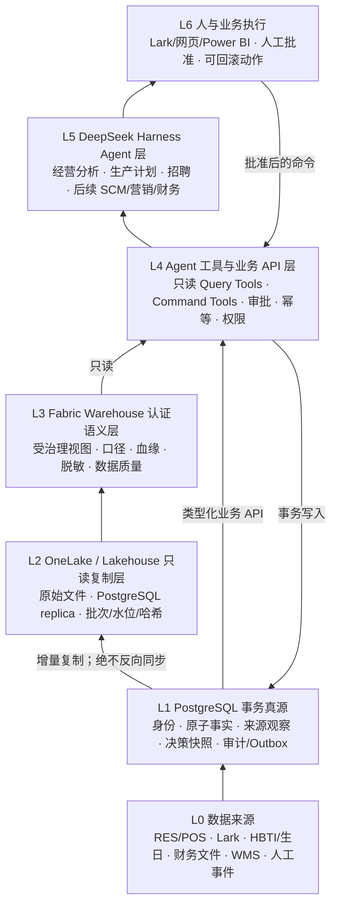
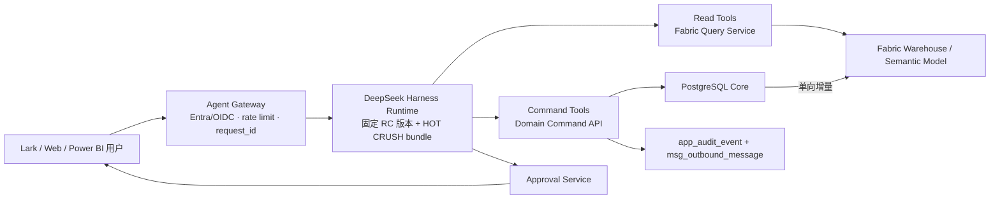

# HOT CRUSH Fabric + DeepSeek Harness + PostgreSQL 目标架构

> 版本：设计草案 v0.1（2026-08-16）
>
> 状态：**DESIGN ONLY / 未执行 DDL、DML、Fabric 创建、应用切换或部署**
>
> 目标：在不破坏已开始真实使用的 POS、会员、HBTI/生日、招聘、财务与消息功能的前提下，建立可逐步落地的企业数据与 Agent 平台。

## 1. 结论

1. **不要把现有 PostgreSQL 直接改成 Fabric SQL Database。** Fabric SQL Database 是基于 Azure SQL Database 引擎的 T-SQL OLTP 数据库，不是 PostgreSQL 托管形态。当前四个应用使用 PostgreSQL 驱动和大量 PostgreSQL 专有契约；现在换引擎会把“重构数据模型”扩大成“重写数据模型、SQL、驱动、认证和运维”，而当前生产库只有约 92.6 MiB，不存在由规模迫使换引擎的事实。
2. **PostgreSQL 继续作为唯一事务真源；Fabric 作为只读分析、语义和 BI 平台。** 当前最优路线是 Supabase PostgreSQL 17 → Fabric Data Factory 增量复制 → OneLake/Lakehouse → Fabric Warehouse 认证视图 → Power BI 语义模型。未来若迁入 Azure，优先迁到 Azure Database for PostgreSQL Flexible Server，再使用 Fabric 原生 Mirroring；仍不必改成 SQL Server 引擎。
3. **R6 Green 不能直接接管生产。** 它当前只有 100 张 Phase 1 空表、1,374 列、零视图、零业务数据、零策略；R6A1 又是 105 表/1,470 列的设计 overlay，明确未编译、不可应用。应先冻结一个 R6A2 权威版本，再回填和切换。
4. **最大限度复用 DeepSeek Harness，但不 fork。** Harness 负责 agent loop、插件装配、模型适配、工具管线、会话事件、审批和沙箱接口；HOT CRUSH 只新增薄插件层和业务 API。它在 2026-08-13 才公开，当前版本 `0.1.0-rc.5`，官方明确标为 developer preview 且将发生破坏性变更，因此必须锁版本并隔离兼容边界。
5. **Agent 不直接写数据库，也不直接运行自由 SQL。** 只读分析走 Fabric 认证视图/语义模型；业务写入只走类型化 Domain Command API，经过身份、范围、幂等、审批、事务、审计和 outbox。
6. **首期只落三个 Agent：经营分析、生产计划草稿、招聘进度。** 供应链、营销和财务 Agent 先保留设计，不在事实来源和审批链未成熟时同时上线。

## 2. 前提检查

| 原观点或问题 | 判定 | 对设计的影响 |
|---|---|---|
| “项目目前都没有落地” | **不成立** | Agent 平台未落地，但 POS/会员同步、HBTI、生日预约、招聘、财务、成本卡、消息任务已读写生产库，必须兼容迁移。 |
| “数据库可以完全重构” | **有条件成立** | 新 Green 库几乎空，可大改目标结构；生产库不能原地推倒。应蓝绿迁移。 |
| “Fabric 可以替代 PostgreSQL” | **概念混淆** | Fabric 同时包含 OLTP SQL Database、Warehouse、Lakehouse、Data Agent；它们用途不同。 |
| “最大限度依赖 Harness 能降低研发难度” | **合理推测** | 可减少 agent loop、工具、会话、模型适配工作，但企业身份、业务权限、审计、数据契约和运维仍须自建。 |
| “数仓等数据量大了再建” | **不成立** | 数仓的首要价值是口径、血缘、权限和复用，不只是容量；但当前规模允许先用最小配置和低频增量。 |

## 3. 已确认事实

### 3.1 生产库（2026-08-16 只读实时核验）

- PostgreSQL 17.6，数据库大小 `97,111,187` bytes（约 92.6 MiB）。
- `public`：78 张表、21 个视图；68 张表有数据，10 张为空。
- 最大事实表：`item_hourly_sales` 85,132 行、`pos_member_order_item` 43,997 行、`pos_member_card_txn` 14,914 行、`pos_member` 4,847 行。
- 最新迁移包括 110（生日卡）和 111（生日通知尝试）；已有一条真实生日预约。
- 四个消费者：BakeryOps、`res_api`、HBTI Web、财务网站。冻结代码扫描记录了 97 个对象、5,070 处引用、1,097 处运行时/脚本引用。

### 3.2 R6 Green（2026-08-16 只读实时核验）

- PostgreSQL 17.6，约 18.8 MiB。
- 100 张表、1,374 列、0 个视图。
- 100/100 开启并强制 RLS；0 条 policy。
- 只有 `app_schema_migration` 约 1 行，其余业务表为空。
- 没有应用连接、没有业务切换。

### 3.3 目标模型状态

- 已应用 Green 基线：R6 Phase 1，100 表。
- 后续 R6A1 resolved overlay：Phase 1 105 表/1,470 列；全局 142 张物理候选表、59 个逻辑视图。
- R6A1 文档明确是 `DESIGN_ONLY_NOT_COMPILED / NOT_APPLY_COMPATIBLE / NOT_ACTIVATED`。
- “可计算不落库”重审把 105 张 Phase 1 表重新分为：59 张标准事实/身份、15 张来源汇总观察、5 张决策快照、2 张摄取台账、19 张平台侧车、5 张结构契约。

### 3.4 外部产品事实

- [Fabric SQL Database](https://learn.microsoft.com/en-us/fabric/database/sql/overview) 是 Azure SQL Database 引擎上的 OLTP 数据库，自动复制到 OneLake。
- [Fabric 数据存储决策指南](https://learn.microsoft.com/en-us/fabric/fundamentals/decision-guide-data-store) 明确区分：SQL Database=OLTP、Warehouse=企业数仓/OLAP、Lakehouse=大数据/半结构化/ML。
- [Fabric PostgreSQL Connector](https://learn.microsoft.com/en-us/fabric/data-factory/connector-postgresql-overview) 支持 Dataflow Gen2、Pipeline Copy 和 Copy Job 的 source/destination，以及 full/incremental load。
- [Azure PostgreSQL Mirroring](https://learn.microsoft.com/en-us/fabric/mirroring/azure-database-postgresql) 目前针对 Azure Database for PostgreSQL Flexible Server；镜像 SQL endpoint 是只读分析副本。
- [DeepSeek Harness](https://github.com/deepseek-ai/deepseek-harness) 为 MIT 开源、插件化 agent harness；官方 README 明确它处于 developer preview，会有兼容性破坏。

## 4. 第一性原则

### 4.1 真源规则

任何事实在任何时刻只能有一个权威写者：

- 业务原子事实、人工决定、审批和状态变化：PostgreSQL Core。
- 来源系统独立上报的汇总：PostgreSQL 来源观察层，只用于对账，不冒充标准事实。
- 可确定重算的指标：视图、Warehouse 认证视图或 Power BI measure，不写回业务表。
- Fabric 中的复制表：只读副本，必须带来源、批次、水位和校验值，不成为第二真源。
- Agent 输出：建议不是事实；只有被人批准并通过业务 API 执行的动作才成为业务事实。

### 4.2 最小事实规则

物理保存仅限以下类型：

1. 稳定身份和版本化规则；
2. 不可变事件、人工行为和状态变化；
3. 独立来源观察；
4. 曾经驱动真实行动、事后不可完全重建的决策快照；
5. 安全、恢复、幂等、审计和消息投递侧车；
6. 明确标注为 replica/cache 的分析副本。

占比、客单价、折扣率、排名、毛利、预测准确率、漏斗转化率、Agent 成功率等默认只派生。

## 5. 目标金字塔

关键约束：**不存在 Fabric → PostgreSQL 的通用回写管道，也不存在 LLM → 数据库的直连。**

## 6. PostgreSQL Core：R6A2 结构

R6A2 不是再造一套表，而是以 R6A1 resolved catalog 为底稿，完成下列冻结：

### 6.1 六类物理结构

| 类别 | 首期数量 | 代表表 | 使用规则 |
|---|---:|---|---|
| 标准事实/身份 | 59 | `ops_location`、`ops_product`、`pos_order_item`、`hr_application_stage_event`、`mkt_reward_claim` | 可作为业务真源；一行一种粒度。 |
| 来源观察 | 15 | `pos_sales_day`、`pos_sales_hour`、`pos_daily_breakdown`、`finance_sales_daily` | `reconciliation_only`；不得与重算结果相加。 |
| 决策快照 | 5 | `ops_forecast_run/_line`、`ops_production_plan_version/_line` | 标记 `decision_snapshot_nonstandard`；不能冒充实际销售/生产。 |
| 摄取台账 | 2 | `pos_ingest_batch`、`finance_import_batch` | 保存来源窗口、parser 版本、行数和校验值。 |
| 平台侧车 | 19 | `app_audit_event`、`app_session`、`msg_outbound_message`、`ai_call` | 安全、恢复、幂等、审计所需。 |
| 结构契约 | 5 | `app_currency`、`finance_fx_rate_observation` 等 | 只有币种/法律实体决策批准后才激活。 |

### 6.2 稳定连接脊柱

- 地点：`ops_location.location_id`
- 企业产品：`ops_product.product_id`
- POS 商品：`pos_product_listing.listing_id`
- POS→企业产品版本映射：`pos_product_mapping(listing_id, product_id, valid_from, valid_to)`
- 原料：`scm_material.material_id`
- 人员/雇佣：`hr_person.person_id` / `hr_employment.employment_id`
- 会员/会员卡：`pos_member.member_id` / `pos_member_card.member_card_id`
- 来源：`app_source_system.source_system_id`
- 批次：`pos_ingest_batch.pos_ingest_batch_id` / `finance_import_batch.finance_import_batch_id`

名称、手机号、外部编号、日期字符串和 JSON key 都不能作为跨域身份键。

### 6.3 必须在 R6A2 修正的四项

1. 落实所有表的 `fact_kind` 与所有字段的 `value_role`；自动拒绝派生指标混入物理字段。
2. 收紧 `mkt_survey_result`：新 HBTI 结果从答案和算法版本现算；仅保留历史不可复算锚点或用户已看到的外发快照引用。
3. 收紧 `mkt_reward_stock`：保留人工分配量；预留/已领/损坏从 `mkt_reward_claim` 事件派生，不把可变计数器当真源。
4. 先实现并真实验证核心 SQL 视图，再回填：销售日/小时、订单商品、产品身份、会员状态、报废和来源对账。

## 7. Agent 平台最小新增表（10 张）

现有 `ai_prompt_template/_segment`、`ai_call`、`msg_conversation/_message`、`app_job_run`、`app_audit_event` 继续使用；只补缺失的企业运行契约。

| 表 | 一行粒度 | 关键字段 | 为什么必须物理保存 |
|---|---|---|---|
| `ai_agent_release` | Agent 代码 × 发布版本 | `agent_release_id, agent_code, version_no, harness_version, bundle_sha256, prompt_template_id, model_provider, model_name, status, approved_by_user_id, approved_at` | 冻结当时实际运行的 Harness、插件、Prompt 和模型组合。 |
| `ai_tool_definition` | 工具代码 × 契约版本 | `tool_definition_id, tool_code, contract_version, owner_domain, input_schema, output_schema, risk_level, idempotency_required, status` | 工具契约和风险等级是审批/审计依据。 |
| `ai_agent_tool_policy` | Agent 发布 × 工具 × 权限规则 | `agent_release_id, tool_definition_id, role_code, location_scope_mode, approval_mode, max_calls_per_run, valid_from, valid_to` | 保存批准过的能力边界，而不是运行时临时猜测。 |
| `ai_run` | 一次用户目标或后台 Agent 任务 | `ai_run_id, conversation_id, agent_release_id, actor_user_id, location_id, goal_code, input_manifest, status, started_at, completed_at, error_code` | 多次模型请求和工具调用必须归属于一次可审计目标。 |
| `ai_tool_execution` | 一次工具调用 | `tool_execution_id, ai_run_id, call_seq, tool_definition_id, input_sha256, output_sha256, idempotency_key, risk_level, result, audit_event_id, started_at, completed_at` | 工具执行是不可变技术事实；用于重放、责任和成本核查。 |
| `ai_approval` | 一次审批决定 | `approval_id, tool_execution_id, policy_code, decision, reason, decided_by_user_id, decided_at` | 批准/拒绝是人的业务行为，必须独立于模型建议保存。 |
| `ai_session_log_manifest` | 一份密封会话日志 | `session_log_id, conversation_id, storage_uri, first_seq, last_seq, sha256, redaction_policy_version, encryption_policy_version, sealed_at` | Harness JSONL/SQLite 日志放加密对象存储；数据库只存不可抵赖的清单和哈希。 |
| `ai_eval_case` | 一个版本化测试用例 | `eval_case_id, agent_code, dataset_version, input_ref, expected_assertions, risk_tags, status` | 防止只凭演示主观判断 Agent。 |
| `ai_eval_run` / `ai_eval_result` | 一次评测运行 / 用例结果 | 发布版本 × 数据集；运行 × 用例 | 支持发布门禁和版本回归。 |

这些表属于 `ai_` 域；业务结果仍写各自 `ops_`、`hr_`、`scm_`、`mkt_` 或 `msg_` 表。

## 8. Fabric 结构

### 8.1 Workspace 与 Item

| Workspace | Item | 作用 |
|---|---|---|
| `hc-data-dev` | `lh_hc_raw_dev`, `wh_hc_analytics_dev` | 非生产数据、管道和语义开发。 |
| `hc-data-prod` | `lh_hc_raw`, `wh_hc_analytics` | 受限数据工程；普通业务用户不直接进入。 |
| `hc-ops-prod` | `sm_hc_ops`, 运营报表 | 经营、商品、排产和活动分析。 |
| `hc-restricted-prod` | `sm_hc_hr`, `sm_hc_finance`, `sm_hc_agents` | HR、财务、Agent 审计的受限语义模型。 |

Trial 只能用于 `hc-data-dev`。地区一经选择会形成数据驻留和迁移成本，激活前必须先确定未来 PostgreSQL/OneLake 区域和个人数据要求。

### 8.2 Lakehouse：只存来源与副本

`lh_hc_raw` 采用两类内容：

1. `Files/source/<source>/<dataset>/<business_date>/<batch_id>/...`：RES 原始捕获、Lark 导出、财务 Excel/CSV、外部文档；对象不可覆盖，清单保存 SHA-256、parser 版本和批次。
2. `Tables/replica_pg_<table>`：PostgreSQL 的只读分析副本，附加 `_replica_batch_id`、`_source_updated_at`、`_source_deleted`、`_source_sha256`、`_replicated_at`。

默认**不复制**：`pos_member_contact`、`hr_person_contact`、`app_session`、`app_one_time_token`、验证码/令牌、完整 prompt、完整渠道收件人和密码/密钥类字段。

### 8.3 Warehouse：认证视图而不是第二事实库

`wh_hc_analytics` 初期只建以下 schema：

- `cert`：认证只读视图，统一业务日期、币种、身份和质量状态；从 Lakehouse replica 查询。
- `mart`：面向主题的只读视图，不建物理汇总表。
- `gov`：指标定义、数据资产目录、血缘、质量规则和刷新状态。

首批认证视图：

- `cert.v_sales_line`
- `cert.v_sales_day_source`
- `cert.v_sales_hour_source`
- `cert.v_product_identity_current`
- `cert.v_waste_event`
- `cert.v_member_daily_source`
- `cert.v_forecast_decision`
- `cert.v_production_plan_current`
- `cert.v_recruitment_stage_event`
- `cert.v_reward_claim`
- `cert.v_finance_source_line`
- `cert.v_agent_run`
- `cert.v_agent_tool_execution`

首批主题视图：

- `mart.v_ops_daily`
- `mart.v_product_daily`
- `mart.v_member_daily`
- `mart.v_recruitment_funnel_daily`
- `mart.v_finance_reconciliation_monthly`
- `mart.v_agent_quality_daily`

客单价、折扣率、毛利、转化率、预测准确率、Agent 成功率等放在 Power BI measure/认证视图，不在 Fabric 再物理缓存。只有监测证明查询 SLA 不达标时，才提交“物化缓存例外”审批。

### 8.4 PostgreSQL → Fabric 同步

当前 Supabase 路线：

- Append-only 表：按稳定 ID/`created_at` 增量。
- Mutable master/workflow 表：按 `updated_at` 水位 + 周期性主键校验。
- 删除：业务事实不物理删除；主数据使用状态/有效期。必须删除的技术数据输出 tombstone。
- 无可靠水位的遗留表：当前不足 100 MiB，先每日全量快照和 hash 对账，不伪装 CDC。
- 每个批次保存源行数、目标行数、主键集合 hash、数值守恒和最大水位。

未来 Azure 路线：PostgreSQL 保持 PostgreSQL，迁到 Azure Database for PostgreSQL Flexible Server 后启用 Fabric Mirroring；Fabric 仍是只读副本。

## 9. DeepSeek Harness 结构

### 9.1 复用边界

直接复用：

- Agent loop、turn/step 生命周期；
- append-only session event log；
- model adapter registry；
- tool registry 与 `pre-execute → guard → approval → execute → post-execute` 管线；
- profile/bundle/plugin 组合；
- sandbox、filesystem、subprocess、session persistence、telemetry 的 provider seam；
- Web/Headless/Python SDK 入口。

HOT CRUSH 自建：

- `hc-identity-plugin`：Entra/Lark/网页身份映射到 `app_user`；
- `hc-policy-plugin`：角色 × 工具 × 地点 × 风险 × 生效期；
- `hc-domain-tools`：只调用内部 Query/Command API；
- `hc-audit-plugin`：写 `ai_run`、`ai_tool_execution`、`app_audit_event`；
- `hc-approval-plugin`：Lark/网页批准；
- `hc-session-export-plugin`：密封会话日志并写 manifest；
- `hc-otel-plugin`：日志、指标和 trace。

禁止做法：fork Harness loop、把业务逻辑写进系统 prompt、让模型获得裸 Bash/裸数据库连接、把默认 `danger-full-access` 示例用于生产。

### 9.2 运行拓扑

## 10. Agent 目录

| Agent | 读取 | 可提出的动作 | 写入边界 | 首期 |
|---|---|---|---|---|
| `router` | 用户身份、会话、Agent 目录 | 路由任务 | 不写业务表 | 是 |
| `ops_analyst` | Fabric 运营认证视图 | 解释销售/报废/断货/会员变化 | 只写 `ai_*` 日志 | 是 |
| `production_planner` | 销售、预测、产品、规则、历史计划 | 生成计划草稿和变更说明 | 经批准写 `ops_production_plan_version/_line`；不能写实际生产 | 是 |
| `recruitment_coordinator` | 招聘需求、申请、阶段、预约 | 生成筛选建议、预约草稿、提醒 | 经规则/人工写 `hr_*` 与 `msg_outbound_message` | 是 |
| `scm_planner` | 已发布生产计划、物料、配方、库存/采购来源 | 补货和采购草稿 | 供应链来源闭环后再启用 | 后续 |
| `member_marketing` | 会员脱敏语义、活动、奖励领取 | 活动名单/奖励草稿 | 禁止直接改会员余额/积分；走 `mkt_*` 状态机 | 后续 |
| `finance_reconciler` | 财务与 POS 认证视图 | 解释差异、列出待核查证据 | 默认只读；不能自动过账 | 后续 |
| `data_quality_guard` | 批次、对账、刷新和质量规则 | 建事故、阻断下游发布 | 写 `app_job_run`/审计/告警，不改来源事实 | 后续 |

Fabric Data Agent 可作为英文只读自助问数入口或 Harness 的一个只读工具，但不是上述业务 Agent 的替代：官方当前限制为只生成 read 查询、最多五个数据源、不支持非英语、不能执行复杂因果分析，也不能执行写动作。

## 11. 工具风险与审批

| 风险 | 示例 | 规则 |
|---|---|---|
| R0 | 读认证指标、读状态 | 自动执行；行列范围和结果条数受限。 |
| R1 | 创建草稿、生成文件、排队但未发送 | 自动或一次确认；必须幂等。 |
| R2 | 发布计划、修改候选阶段、发送内部消息 | 指定角色人工批准；记录 before/after。 |
| R3 | 发会员权益、取消预约、发送外部消息、采购确认 | 双确认或职责分离；强幂等、补偿方案。 |
| R4 | 财务过账、权限授予、批量删除、数据库迁移 | Agent 永不直接执行，只生成审批包/迁移文件。 |

## 12. 保证现有功能完好的迁移流程

### Phase 0 — 冻结事实与验收基线（1–2 周）

- 锁定 R6A2 模型 hash，解决 100 表已应用基线与 105 表 R6A1 overlay 的分叉。
- 对四个项目建立 SQL 契约测试和业务功能清单。
- 生产库生成 S0 加密只读快照；逐表记录行数、主键 hash、金额守恒和最大水位。
- 任何生产写路径不得直接改为 Fabric。

**门禁：** 当前生日预约、HBTI 登录/完成、RES 刷新、预测/复盘、招聘、财务登录与成本查询全部通过现有端到端测试。

### Phase 1 — 重建空 Green（1 周）

- 因 Green 无业务数据，可把它视为可重建环境；从冻结 R6A2 迁移文件一次性重建。
- 先建表、约束、索引、RLS 壳和注释；再建已通过运行验证的视图。
- 不授予应用写权限，不切连接串。

**门禁：** 模型 fingerprint、105 类别守恒、全部 FK/index/RLS/comment、视图 SELECT 均通过。

### Phase 2 — 确定性回填（1–2 周）

- 旧库 → S0 → R6A2；每个源行只能是 `TARGET`、`QUARANTINE` 或批准的 `EXCLUSION`。
- 相同 S0 重跑必须零 DML；无法映射的产品/员工/原料进入 review 表，不按名称静默猜。

**门禁：** 当前 78 张生产表（包括旧冻结矩阵之后新增的生日表）全部有唯一去向；旧版 76 表迁移矩阵必须刷新，不能把“旧矩阵已覆盖”误当成“当前生产已覆盖”。关键金额、会员、订单行、报废和成本卡逐项对账。

### Phase 3 — Shadow Read（至少两个真实业务周期）

- 现有应用继续读写旧库；Green 只接收单向追平。
- 同一 API 同时运行旧查询和新查询，用户仍看到旧结果；差异写审计。
- 产品、会员、招聘、生日、财务各设容差；身份和状态类要求精确一致。

### Phase 4 — 分域切换

顺序建议：

1. 只读分析查询；
2. `res_api` 的 POS 单一写者；
3. HBTI/生日营销域；
4. BakeryOps 的 ops/hr/msg/ai；
5. 财务与成本域。

每域切换：停止该域旧写者 → 最终增量 → 守恒核对 → 切唯一写者 → 观察 → 切读者。旧库保留只读回滚窗口。

### Phase 5 — Fabric Dev 试点

- 只复制 8–12 张非敏感核心表；不复制联系人、会话令牌和 HR 明细。
- 创建 `mart.v_ops_daily`、`mart.v_product_daily` 和一个 Power BI 语义模型。
- 用 30 个固定问句验证口径、权限、新鲜度和生成 SQL。

### Phase 6 — Agent 试点

- 锁定 Harness `0.1.0-rc.5`（或批准的后续版本）和 HOT CRUSH bundle hash。
- 经营分析 Agent 只读上线；生产计划 Agent 只能创建草稿；招聘 Agent 只对内部员工开放。
- 先运行 2 周 shadow/人工并行，再允许 R2 动作。

## 13. 验收标准

### 数据

- 每张业务表有唯一粒度、唯一写者、`fact_kind`；每个字段有 `value_role`。
- Fabric replica 与 PostgreSQL 按批次行数、主键 hash、金额守恒和水位一致。
- 来源观察和标准事实不能被 UNION/相加成一个“总数”。
- 可重算指标不进入 PostgreSQL/Fabric 物理表，除非有已批准的缓存例外。

### 应用

- 现有真实功能在旧库、shadow Green、切换后的 Green 上使用同一套契约测试。
- 每个域切换都能在不反向同步的情况下回到旧库只读/旧应用版本。
- `ON CONFLICT` 写路径不通过兼容视图切换；必须使用目标表或业务 API。

### Agent

- 任何业务写动作能追溯到：用户 → Agent release → Prompt/model → tool contract → approval → DB transaction → audit event。
- 未批准工具、越权地点、超风险等级、缺 idempotency key、输出 schema 无效时 fail closed。
- 经营问答固定集准确率、引用完整率、拒答正确率达到发布阈值；R2/R3 动作保持 100% 审批覆盖。

### 安全

- PostgreSQL RLS/权限不会被误认为自动传播到 OneLake；Fabric/Power BI 重新配置独立权限。
- 联系方式、令牌、验证码、完整 prompt 和外部收件人默认不进入 Fabric。
- Harness 生产 profile 无裸 Bash、裸文件系统和裸数据库工具；运行在容器/沙箱内。

## 14. 当前不做

- 不激活 Fabric Trial 并直接创建生产资产；
- 不把当前 Supabase PostgreSQL 改写为 Fabric SQL Database；
- 不把 Warehouse 当业务主库；
- 不在 Green 仍为空时把 142 张未来候选表全部启用；
- 不同时上线 7–9 个 Agent；
- 不让 Fabric Data Agent 或 DeepSeek Harness 直接改财务、权限或生产数据库；
- 不用模型回答替代指标定义、数据质量和人工批准。

## 15. 下一步执行包

第一批实际工作只应包含四件事：

1. 生成 R6A2 决策记录：把 R6A1 overlay、最小事实重审和本 Fabric/Agent 分层合成一个权威版本；
2. 生成 Agent 10 张新增表的声明模型与迁移草案，不执行；
3. 为当前四项目建立功能/SQL 契约测试基线；
4. 在 Fabric Trial 的最终地区和条款确认前，先批准 `hc-data-dev` 的区域、数据驻留和成本边界。

只有 1–3 通过后，才值得创建 Fabric 数据资产；只有只读经营分析 Agent 通过固定评测后，才启用生产计划草稿 Agent。
