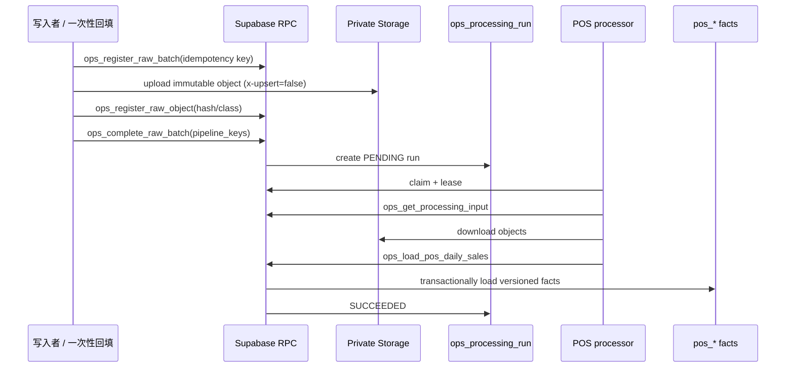

# HOT CRUSH R6 Green 数据库蓝图 v1

> 状态：R6 Green 数据库基座已实施；现网应用未切库。
>
> 核验时间：2026-08-20（Asia/Kuala_Lumpur）。
>
> R6 Green：`hotcrush-core-r6-green` / `tmmkknnkcptunxbfjxqn`。
>
> 旧生产真源：`supabase-yellow-crystal` / `ecsgqcmwtjmcpzqytdqw`。

## 1. 结论

R6 Green 已建成一个适合单店阶段的 Supabase 分层数据平台：

- 不引入 Fabric、Kafka、Airflow 或外部向量库。
- 在同一个 Supabase Project 内使用 PostgreSQL、Storage、pgvector、RLS、RPC、Cron 和 Realtime。
- Raw 原件放私有 Storage，PostgreSQL 只放元数据与处理状态。
- Processed 层只建立已有明确粒度的结构化事实；目前已有 POS 日销售和小时销售版本表。
- PDF RAG 已具备分级、上传、解析、切块、embedding、发布和检索的数据库契约。
- POS 已具备 Raw 文件校验、日/小时交叉对账、版本发布、隔离和恢复的结构化 worker。
- Agent 层只保存运行账本和追加事件，不让 Agent 直接任意写业务表。
- 现网 BakeryOps、res_api 仍使用旧生产库；没有替换 `DATABASE_URL`，没有开启双写或切读。

这不等于“整个旧业务库已迁移”。当前完成的是新库物理基座、PDF 技术样本和 POS 单日迁移演练；持续影子写入、其他业务域回填和应用切换仍需以后分别批准。

## 2. 前提检查

### 2.1 一个 Project 内不是再建多个“数据库”

Supabase Project 通常对应一个 PostgreSQL database。本蓝图的 Raw、Processed、RAG、Agent 和交互层，在网页上表现为：

- `public` 里带域前缀的表、view 和 RPC；
- `private` 里的权限辅助函数；
- Storage 里的私有 bucket 和 object；
- Database 页里的 extensions、roles、RLS policies、Cron 和 publication。

分层是责任和生命周期的分离，不是把同一行数据复制五份。

### 2.2 “新数据会自动上流”不是 PostgreSQL 自然发生的

自动化必须同时有：

1. 写入者登记 Raw batch/object；
2. 完成 batch 时建立 processing run；
3. worker 以租约方式领取、处理并发布；
4. Cron 负责超时恢复、健康汇总和对账。

Cron 不应每天全量复制 Raw；它是补偿机制，不是主数据流。

### 2.3 PDF 流程属于 RAG，但“存 PDF”不等于“已做 RAG”

- PDF 原件：Storage object。
- 文档版本和分级：`ai_raw_document`。
- OCR/解析运行：`ai_ingest_run`。
- 可引用文本：`ai_document_chunk`。
- 向量：`ai_chunk_embedding`。
- 检索：`ai_search_knowledge(...)`。

只有这条链全部成功且文档发布为 `READY`，才是可用 RAG。

## 3. 已确认的 R6 物理状态

| 项目 | 已确认状态 |
|---|---|
| Supabase Project | `tmmkknnkcptunxbfjxqn`，ACTIVE_HEALTHY，us-east-1 |
| CLI migrations | 20 个，本地与远程编号完全一致 |
| 业务/平台表 | 14 张 |
| views | 2 个 POS current views |
| 受控 RPC | 33 个 `ops_*` / `ai_*` functions |
| private Storage | 7 个 bucket，均 `public=false`，单文件限制 100 MiB |
| extensions | `vector` 在 `extensions` schema；`pg_cron` 已安装 |
| Cron | 6 个短任务 |
| Realtime | 仅 `ops_agent_run`、`ops_agent_event`、`ai_ingest_run` |
| machine roles | 7 个 NOLOGIN capability roles |
| 本地数据库测试 | 7 个 pgTAP 文件，63 项通过 |
| 远程 lint | `public` + `private` 无 schema error |
| 远程 drift | `supabase db diff --linked --schema public,private` 无差异 |
| PDF 样本 | 3 页 PDF 已完成 6 chunks / 1536 维 embedding 并可按页检索 |
| POS 迁移演练 | 1 个最终业务日 + 11 个小时，旧库→R6 自动对账 0 差异 |
| 回滚演练 | 不完整 batch 已隔离；已接受 batch 在远端完成 quarantine→current 回退→restore |
| 当前健康 | `degraded`：仅因保留 1 个已知不完整的 quarantined 演练 batch；无失败 run、过期 lease 或 Storage lineage 缺口 |
| 现网应用切换 | 未开始；仍只使用 `ecsgqcmwtjmcpzqytdqw` |

## 4. 总体数据结构图

汇报资产：

- PNG：`docs/database/diagrams/hotcrush-r6-green-blueprint.png`
- SVG：`docs/database/diagrams/hotcrush-r6-green-blueprint.svg`
- 可编辑 Mermaid 源码：`docs/database/diagrams/hotcrush-r6-green-blueprint.mmd`

```mermaid
flowchart TB
  subgraph S[写入源]
    POS[RES POS / 旧库只读回填]
    PDF[Brain PDF]
    FILE[财务/HR/SCM 文件]
  end

  subgraph R6[Supabase R6 Green · 同一 Project]
    subgraph RAW[1 Raw 证据层]
      STORE[7 个 Private Storage buckets]
      RB[ops_raw_batch]
      RO[ops_raw_object]
    end

    subgraph PROC[2 预处理/事实层]
      PR[ops_processing_run]
      PD[pos_sales_day]
      PH[pos_sales_hour]
      CV[v_pos_*_current]
      KS[ai_knowledge_space]
      DOC[ai_raw_document]
      IR[ai_ingest_run]
      CHUNK[ai_document_chunk]
      VEC[ai_chunk_embedding vector\(1536\)]
    end

    subgraph AGENT[3 Agent 层]
      AR[ops_agent_run]
      AE[ops_agent_event<br/>只追加]
    end

    subgraph UI[4 交互契约层]
      RPC[PostgREST / 受控 RPC]
      RT[Realtime 状态]
    end

    CRON[6 个 Cron<br/>恢复·汇总·对账·清理]
    GOV[RLS · Grants · Roles · Audit]
  end

  WK[外部 worker<br/>OCR · 解析 · embedding · 长任务]
  USERS[未来 Web / Lark / WhatsApp / Agent]
  OLD[旧生产库<br/>ecsg...<br/>现在仍是唯一业务真源]

  POS -. 持续影子写入未启用；单日回填已验收 .-> RB
  PDF --> STORE
  FILE -. 未迁移 .-> STORE
  RB --> RO
  RO --> PR
  PR <--> WK
  PR --> PD
  PR --> PH
  PD --> CV
  PH --> CV
  RO --> DOC
  DOC --> IR
  IR <--> WK
  IR --> CHUNK
  CHUNK --> VEC
  CV --> AR
  VEC --> AR
  AR --> AE
  AR --> RPC
  AE --> RT
  RPC --> USERS
  RT --> USERS
  CRON --> PR
  CRON --> IR
  CRON --> AR
  GOV --- RAW
  GOV --- PROC
  GOV --- AGENT
  OLD --> USERS
```

虚线表示“数据库契约已准备，现网运行配置未启用”。

## 5. Supabase Dashboard 中看到的结构

```text
Table Editor → public
├── Raw / 调度控制
│   ├── ops_raw_batch
│   ├── ops_raw_object
│   ├── ops_processing_run
│   └── pipeline_health
├── Processed POS
│   ├── pos_sales_day
│   ├── pos_sales_hour
│   ├── v_pos_sales_day_current
│   └── v_pos_sales_hour_current
├── RAG
│   ├── ai_knowledge_space
│   ├── ai_space_member
│   ├── ai_raw_document
│   ├── ai_ingest_run
│   ├── ai_document_chunk
│   └── ai_chunk_embedding
└── Agent
    ├── ops_agent_run
    └── ops_agent_event

Storage
├── raw-business-private
├── kb-internal
├── kb-restricted
├── hr-recruiting-private
├── hr-payroll-private
├── finance-private
└── legal-private

Database
├── Functions: ops_* / ai_*
├── Extensions: vector / pg_cron
├── Roles: hc_* capability roles
├── Policies: public + storage RLS
├── Cron: hc_*
└── Realtime publication: 3 张状态表
```

## 6. 表级蓝图

### 6.1 Raw 与调度

| 表 | 一行代表 | 关键字段 | 更新方式 |
|---|---|---|---|
| `ops_raw_batch` | 一次不可变的来源批次 | `source_system`、`source_batch_key`、`schema_version`、水位、计数、状态 | `ops_register_raw_batch` + `ops_complete_raw_batch` |
| `ops_raw_object` | 批次内一个 Storage object 元数据 | `bucket_id`、`object_path`、`sha256`、`data_class` | `ops_register_raw_object` |
| `ops_processing_run` | 一个 batch 在某 processor 版本下的运行 | `pipeline_key`、`pipeline_version`、lease、attempt、watermark | claim / heartbeat / finish / fail RPC |
| `pipeline_health` | 一个 pipeline 的最新健康汇总 | last success/failure、pending、lag、error | Cron 每 10 分钟汇总，不作队列 |

幂等键：`(source_system, source_batch_key, schema_version)`。重放相同批次返回原记录；属性冲突则拒绝。

### 6.2 Processed POS

| 表 / view | 粒度 | 关键约束 | 说明 |
|---|---|---|---|
| `pos_sales_day` | source batch × store × business date | PK `(source_batch_id,business_date,store_id)` | 保留来源版本，不把财务导入冒充 POS |
| `pos_sales_hour` | source batch × store × date × hour | PK 加 `sales_hour`，hour 0–23 | 保留每个 Raw batch 的版本 |
| `v_pos_sales_day_current` | store × date | 按最新成功 `processing_run_id` 选版本，仅接纳 READY batch | view 不复制数据；quarantine 自动回退 |
| `v_pos_sales_hour_current` | store × date × hour | 同上，避免同事务时间戳相同后按随机 UUID 选版本 | view 不需定时刷新 |

两张事实表已建 RLS，没有直读 policy，默认封闭。处理者只能经 `ops_load_pos_daily_sales` 写入；该 RPC 会同一事务中核验 lease、来源、pipeline，写事实并完成 run。`ops_quarantine_raw_batch` / `ops_restore_raw_batch` 只改变 current 资格，不删除 Raw 或版本化事实。

### 6.3 RAG

| 表 | 一行代表 | 重要约束 |
|---|---|---|
| `ai_knowledge_space` | 一个权限、bucket、分级和 RAG policy 边界 | `AUTO / REVIEW_REQUIRED / REDACTED_ONLY / DENY` 的物理依据 |
| `ai_space_member` | 用户在空间中的角色 | 空间 + user 唯一，RLS 按成员判断 |
| `ai_raw_document` | 一个文档版本 | `(space_id,document_key,version_no)` 唯一，只能发布已成功 run |
| `ai_ingest_run` | 一次解析/embedding 运行 | 租约、重试、阶段、期望 chunk/vector 数 |
| `ai_document_chunk` | 可引用文本块 | 页码、section path、hash、token 数、脱敏标记、tsvector |
| `ai_chunk_embedding` | chunk 在某模型版本下的向量 | PK `(chunk_id,model_version)`，`vector(1536)` |

已建立的知识空间：

| UUID 尾号 | code | 级别 | 默认 RAG |
|---|---|---|---|
| `...0001` | `kb_internal` | C1 | AUTO |
| `...0002` | `hr_recruiting` | C3 | REDACTED_ONLY |
| `...0003` | `hr_payroll` | C4 | DENY |
| `...0004` | `finance_private` | C3 | DENY |
| `...0005` | `legal_private` | C3 | REDACTED_ONLY |
| `...0006` | `kb_restricted` | C2 | REVIEW_REQUIRED |
| `...0007` | `hr_policy_restricted` | C2 | REVIEW_REQUIRED |

完整 UUID 格式为 `10000000-0000-7000-8000-00000000000N`。

### 6.4 Agent

| 表 | 一行代表 | 安全边界 |
|---|---|---|
| `ops_agent_run` | 一次可重试 Agent 运行 | type + dedupe key 幂等；记录 model/prompt 版本、lease、result |
| `ops_agent_event` | Agent 生命周期的一条事件 | 只追加；`UPDATE/DELETE` 由 trigger 阻断；批准回调有 idempotency key |

Agent 不持有业务表的广泛 DML 权限。它只能查订管理 view/检索 RPC，并通过窄命令或审批事件提交行动。

## 7. 每层之间如何自动交互

### 7.1 新业务文件 / POS Raw



当前状态：一次性旧库只读回填与 POS processor 已在 R6 演练通过；根据用户边界，现网 writer 不配置、POS processor 不常驻，因此不会持续自动写 R6。

### 7.2 新 PDF

```mermaid
sequenceDiagram
  participant C as brainctl / 文档入口
  participant DB as R6 RPC
  participant ST as Private Storage
  participant W as RAG worker
  participant V as pgvector

  C->>C: 路径/语义预分类 C1-C4
  C->>DB: register batch
  C->>ST: upload original.pdf
  C->>DB: register object + finalize document
  alt C1 AUTO
    DB->>DB: create PENDING ai_ingest_run
    W->>DB: claim lease
    W->>ST: download PDF
    W->>W: text extraction / OCR / chunk / embedding
    W->>DB: stage chunks + vectors in batches
    W->>DB: publish only after count checks
    DB->>V: current document becomes searchable
  else C2/C3 review or redaction
    DB->>DB: REVIEW_REQUIRED / REDACTED_ONLY
  else C4
    DB->>DB: DENIED; no ingest run
  end
```

### 7.3 Agent

```text
PENDING → RUNNING → SUCCEEDED
                  ├→ AWAITING_APPROVAL → APPROVED event → PENDING
                  ├→ RETRY → RUNNING
                  └→ FAILED / DEAD
```

所有 claim 都使用 `FOR UPDATE SKIP LOCKED` 的数据库租约语义；超时任务由 Cron 恢复，避免一个 worker 死亡后永久卡住。

## 8. 定时任务

| job | 频率 | 作用 | 不做什么 |
|---|---:|---|---|
| `hc_pipeline_health_rollup` | 每 10 分钟 | 汇总 processing 健康、积压和延迟 | 不执行业务 ETL |
| `hc_recover_processing_runs` | 每 5 分钟 | 回收过期 structured lease | 不绕过重试上限 |
| `hc_recover_ingest_runs` | 每 5 分钟 | 回收过期 RAG lease | 不执行 OCR |
| `hc_recover_agent_runs` | 每 5 分钟 | 回收过期 Agent lease | 不自动批准高风险行动 |
| `hc_daily_lineage_reconcile` | UTC 16:30 / KL 00:30 | 生成 Raw→run 完整性对账 | 不修改来源数据 |
| `hc_failed_stage_cleanup` | 每周六 UTC 18:00 | 清理超保留期的失败 staging | 不删已发布 chunk/vector |

新数据的主触发是“完成 Raw batch 时建队列”，不是等每天 Cron 全量更新。

## 9. 分级、Storage 与 RAG 准入

| 级别 | 典型数据 | Storage | 自动 RAG |
|---|---|---|---|
| C1 | 门店 SOP、公开/普通内部知识 | `kb-internal` | 允许 |
| C2 | HR 制度、未分类内部文档 | `kb-restricted` | 需审核 |
| C3 | 简历、合同、法务、财务明细 | 对应私有 bucket | 默认拒绝或仅脱敏 |
| C4 | 薪资、证件、密封资料 | `hr-payroll-private` | 拒绝，不建 chunk/vector |

存储路径不得包含姓名、手机号、证件号或 Mac 本地绝对路径。原件 object 使用 hash 和 UUID 组成，并且 `x-upsert=false`。

## 10. 权限与安全

### 10.1 capability roles

```text
hc_pos_writer
hc_ops_processor
hc_ai_ingestor
hc_agent_worker
hc_hr_worker
hc_scm_worker
hc_msg_worker
```

七个角色均 `NOLOGIN`，表示能力边界，不是可从公网直接登录的数据库账号。

### 10.2 RLS 默认策略

- RAG 内容按 knowledge-space membership 查询。
- Agent run/event 只向请求者暴露。
- POS processed 表目前无直读 policy，默认封闭，防止在尚未定义用户门店范围时提前泄露。
- Storage object 不因拿到 URL 就可读，仍需 bucket policy / member 判断。
- `service_role` 不直接获得平台表的广泛 SELECT/DML；worker 使用 security-definer RPC。

### 10.3 已知局限

- 当前使用 Supabase secret key 调用 worker RPC，还不是每个 worker 独立可轮换 JWT。
- tokyo-01 没有 TPM/磁盘加密；systemd encrypted credential 避免密钥出现在 env/unit 文本，但不能对抗已获得 root 或磁盘的攻击者。
- 远程 `supabase test db --linked` 的 CLI 临时角色不具备 Storage/Auth 内部表权限，因此特权集成 pgTAP 以本地完整重放为权威验证；没有为让远程测试变绿而放宽生产权限。
- 对旧生产库的只读 CLI 查询仍报告 `mkt_birthday_profile`、`mkt_birthday_reservation` 未启用 RLS。这是旧库既存 critical 风险，本阶段没有擅自执行 `ENABLE ROW LEVEL SECURITY`；如果没有先设计 policy，直接启用会阻断现有访问。

## 11. CLI 可重建性验证

已实测的数据库命令：

```bash
# 链接目标 Project（已完成）
npx supabase link --project-ref tmmkknnkcptunxbfjxqn

# 本地从零重放 20 个 migration
npx supabase db reset

# 本地结构检查和 63 项 pgTAP
npx supabase db lint --local --schema public,private
npx supabase test db

# 只将 migration 推入 R6 Green
npx supabase db push --linked

# 远程结构检查
npx supabase db lint --linked --schema public,private

# 使用 shadow database 重放后比较远程 drift
npx supabase db diff --linked --schema public,private

# 核对 migration ledger
npx supabase migration list --linked
```

结果：20 个本地/远程 migration 一致，lint 无错，diff 为 `No schema changes found`。

CLI 能完成 PostgreSQL objects、Storage bucket/policy、extensions、Cron、RLS、roles 和 publication 的创建。CLI 不会把 Playwright、PDF OCR、Tesseract 或 OpenRouter embedding 自动变成 PostgreSQL 内部计算；这些仍需外部 worker。

POS 一次性迁移、处理和对账命令见 `docs/database/hotcrush-r6-green-cli-runbook.md`。这些命令使用独立的 `R6_SUPABASE_*` 凭据，不修改旧应用 `.env`。

## 12. 目前不应创建的结构

单店阶段不应为“未来可能”预建上百张空表。以下域只在准备回填对应数据之前创建：

| 后续域 | 预计对象 | 创建门槛 |
|---|---|---|
| POS 深度事实 | product listing、item sales、waste、member、transaction | 来源 ID/门店 ID/幂等键已冻结，有回填和对账测试 |
| HR | person、application、employment、appointment | PII 分级、保留期、人/雇佣/账号边界确认 |
| SCM | supplier、material、order、receipt | 单位换算、物料身份、采购粒度确认 |
| Finance | import batch、sales daily、cost lines、inventory | POS 与财务真源必须分表，禁止双写 `daily_revenue` |
| Marketing/HBTI | campaign、survey、reward claim | 不再回写 POS 会员主档，手机号不复制到营销事实 |
| Messaging | conversation、message、delivery attempt | 通道幂等键、保留期和脱敏规则已确认 |

这是有意的简化，不是遗漏：先保证每张表有真实写入者、清晰粒度和可验证回填，再增加表。

## 13. 从旧生产库到 R6 的修改顺序

1. 已完成：生成旧库只读快照，确认真实 source ref、结构、写入者和高水位。
2. 已完成：冻结最小 POS 日/小时契约，不把 `daily_revenue` 冒充 RES 原始文件。
3. 已完成：在 R6 建立版本化事实、确定性 current view、回滚和对账 RPC。
4. 已完成一日：旧库以只读事务导出 `LEGACY_POS_EXPORT`，写入 R6 Raw 后由 worker 处理。
5. 已完成一日：2026-07-26 日事实 + 11 小时事实逐字段自动对账，0 差异；不完整旧样本被隔离。
6. 黄金问题集验收 RAG；不以“向量有数据”代替检索质量验收。
7. 单独批准后才开启一个项目的影子写入；后续再批准切读。
8. 所有写入者切换、高水位一致且回滚演练通过后，才考虑冻结旧库写入。

## 14. 验收门槛

### 已通过

- 从空本地库重放所有 migrations。
- 63 项数据库合同/安全/回滚测试通过。
- RLS、Storage private、NOLOGIN roles、Realtime 最小集、Cron 数量均有断言。
- PDF 真实样本从 Storage 到页码引用检索通过。
- R6 远程 lint 无错，migration ledger 对齐，schema diff 无漂移。
- POS 不完整快照在业务对账失败后被真实远端 quarantine，current view 归零且版本未删除。
- POS 最终单日回填通过 1 个日事实 + 11 个小时事实自动对账，随后真实完成回滚与恢复演练。
- 旧生产库运行配置仍指向 `ecsgqcmwtjmcpzqytdqw`。

### 未通过，不得宣称“整库迁移完成”

- 旧生产数据尚未全量回填。
- POS 仅完成单日迁移演练，尚未形成持续影子写入或完整历史回填；HR/SCM/Finance/Marketing 未逐域对账。
- Brain 目录尚未完成全量分类审核与上传。
- RAG 只有技术样本通过，尚无业务黄金问题集。
- 应用配置、Vercel 变量、`DATABASE_URL` 和现网读写路径均未切换。

## 15. 事实、推测、建议和暂无法验证项

### 已确认事实

- R6 Green 当前结构可由 20 个 CLI migration 从零重建。
- 现网 BakeryOps/res_api 仍使用旧生产库。
- PDF 样本检索能返回正确页码与相关文本。
- 2026-07-26 最终 POS 日/小时事实从旧库只读导出后，与 R6 current 自动对账 0 差异。
- 先前的半日 POS Raw 虽技术处理成功，但业务对账失败，现为 `QUARANTINED`，说明“run 成功”不是迁移验收。
- 相同查询也曾在宽松语义描述下把第 3 页排在第 2 页前，所以“可检索”不等于“质量已达标”。

### 合理推测

- 对一家店，当前的单 Project + 外部 worker 足以承载数据量；真正风险更可能来自口径、权限和写入者冲突，而非容量。
- 版本化 fact + current view 比覆盖式 upsert 更适合影子对账和回滚。

### 建议

- 先将 R6 作为独立验收环境，不动现网配置。
- 下一个数据库任务应扩展 POS 历史日期批量回填和分批对账，而不是继续增加空表；持续写入仍需单独批准。

### 暂无法验证

- 未切换前无法证明所有旧库业务读写都可无缝迁往 R6。
- 未全量盘点 Brain 文件内容前，无法证明所有 PDF 都可合规自动 RAG。
- 财务网站的生产 Vercel secret 为不可回读配置；本阶段既不更改，也不假设其可直接切换。
