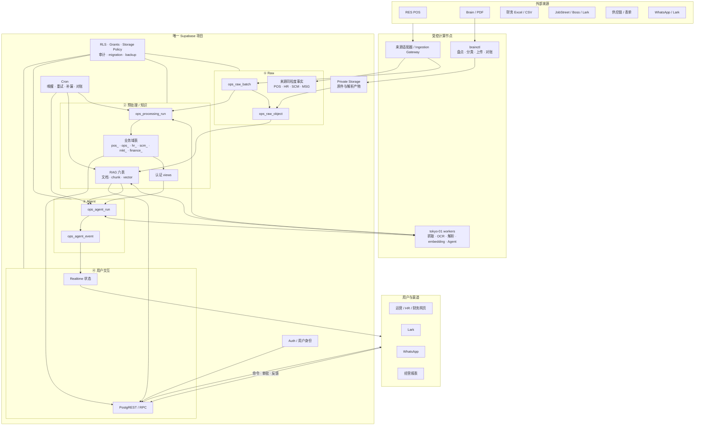
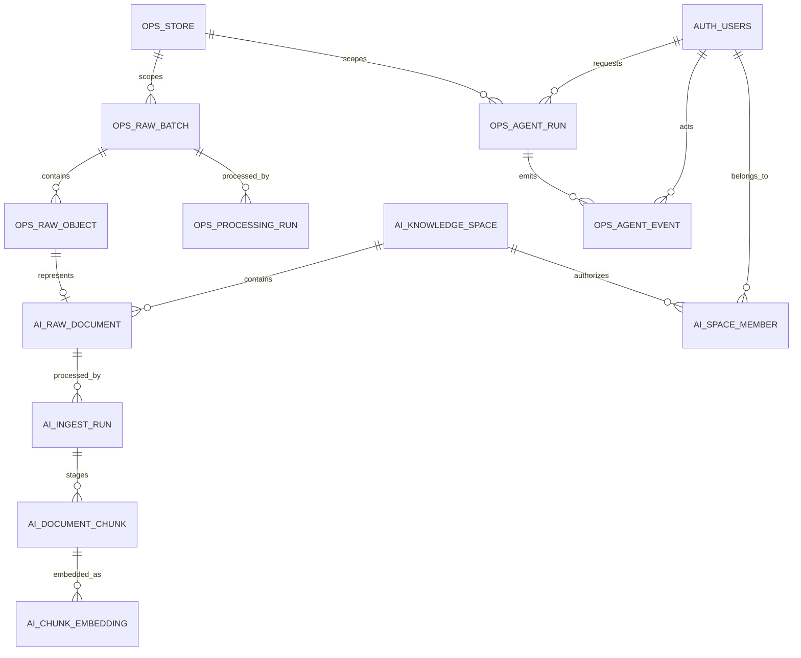
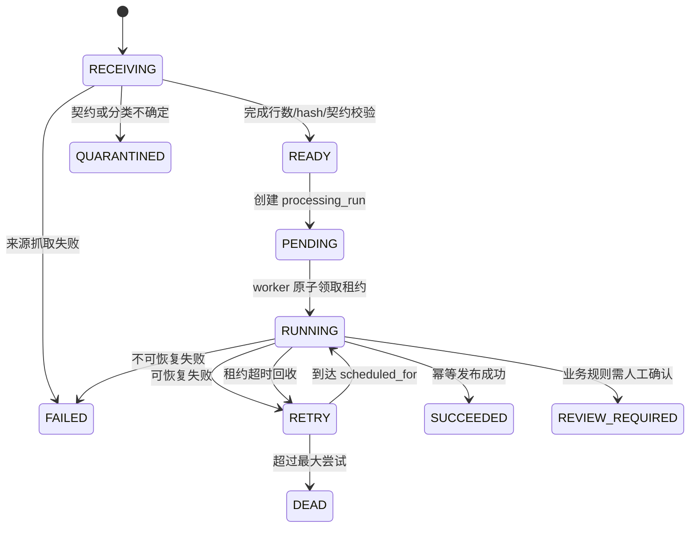
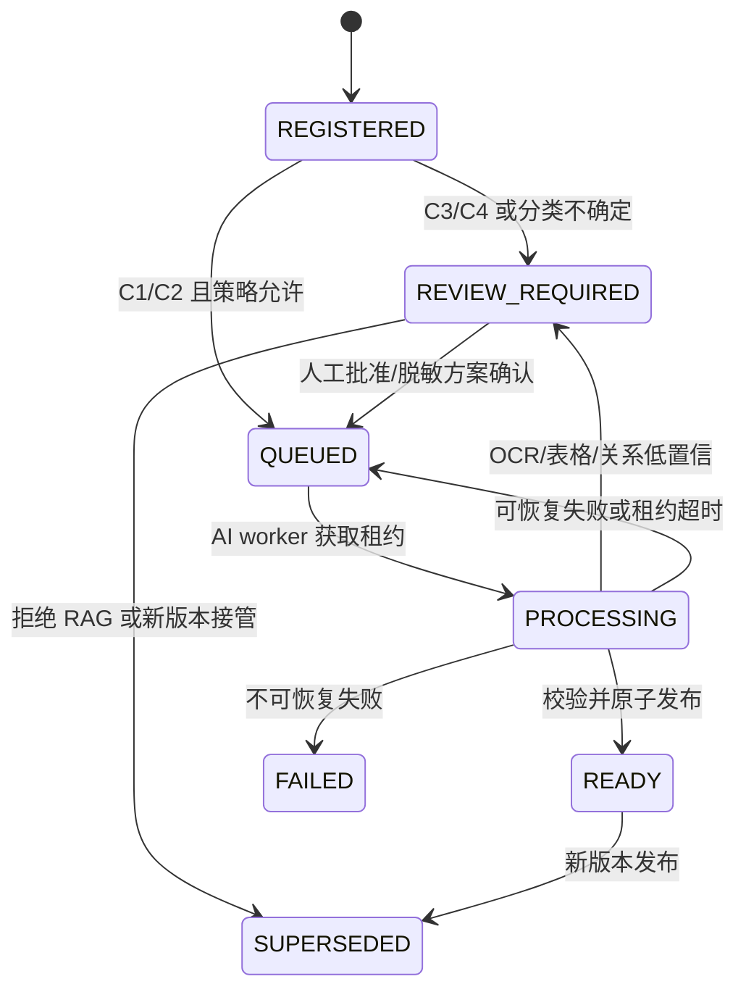
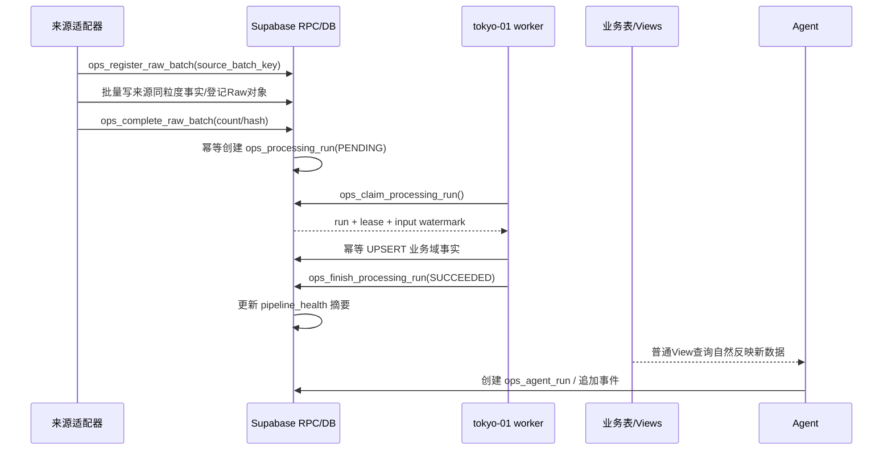
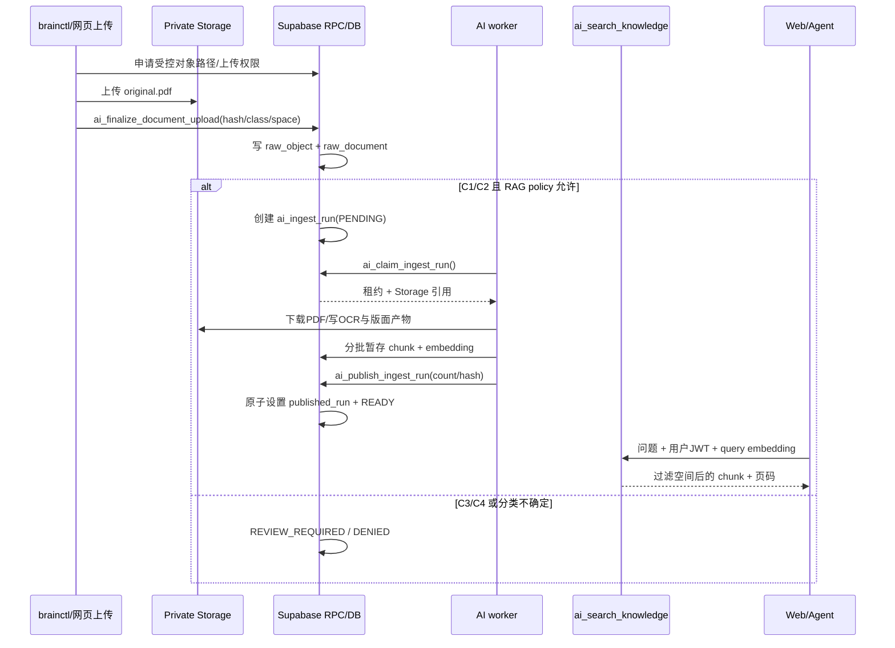

# HOT CRUSH Supabase 数据平台实施蓝图 v2

> 本文是 2026-08-20 实施前的设计草案，已被
> `hotcrush-r6-green-database-blueprint-v1.md` 取代；不再作为实施依据。
>
> 状态：历史设计草案，其表数、bucket 数、项目边界与实际 R6 已不一致。
>
> 旧的 `hotcrush-supabase-internal-architecture-v1.md` 保留为概念背景；若历史文档之间冲突，以新的 R6 Green 蓝图为准。

## 1. 最终结论

HOT CRUSH 当前只有一家实际门店，不需要 Fabric、独立数仓、Kafka、Airflow 或外部向量数据库。目标是：

```text
一个 Source Supabase 生产项目
+ public schema 前缀治理
+ 六个私有 Storage bucket
+ 11 张新增核心控制/RAG/Agent 表
+ 少量受控 RPC
+ Supabase Cron 负责短调度与补偿
+ tokyo-01 worker 负责抓取、OCR、解析、embedding 和长 Agent 任务
+ Auth / RLS / Grants / Storage Policy 贯穿所有层
```

数据主链固定为：

```text
外部来源
  → 统一写入契约
  → Raw 证据与来源事实
  → 可重建的结构化事实 / 认证指标 / RAG
  → Agent 建议与审批事件
  → Web / Lark / WhatsApp / 报表
```

自动化采用“事件产生任务 + worker 增量处理 + Cron 补漏/重试/对账”，不采用定时全量复制 Raw。

## 2. 前提检查与设计纠偏

### 2.1 分层不等于五套表

不是每一层都必须复制一份相同数据：

- PDF、Excel、API 原始响应在 Storage 保存原件，PostgreSQL 保存元数据。
- POS 订单行、会员流水等已经是来源同粒度关系事实，可以直接进入唯一的来源事实表，不再复制一张内容相同的 `raw_*` 表。
- 普通 SQL view 不保存副本，底表更新后查询自然反映最新数据。
- 只有物化视图需要刷新，而且应在上游成功后刷新，固定时钟只作为补偿。

### 2.2 自动 RAG 不等于所有 PDF 自动 embedding

新 PDF 可以自动进入摄取状态机，但只有满足策略的文档才自动建立 RAG：

| 数据级别 | 默认动作 |
|---|---|
| C1 内部资料 | 可自动 OCR、切块、embedding |
| C2 受限资料 | 只在获授权知识空间自动处理 |
| C3 个人机密 | 默认 `REVIEW_REQUIRED`；只允许脱敏文本进入受限 RAG |
| C4 密封资料 | 只保存原件和审计，不创建 chunk/embedding |

因此，“上传即自动 RAG”只适用于已分类且策略允许的 C1/C2 文档。

### 2.3 Supabase 是数据与治理平面，不是所有计算的运行容器

PostgreSQL、Storage、Auth、RPC、Cron 和 Realtime 统一在 Supabase；长时间 OCR、版面分析、Playwright、批量 embedding 和长 Agent 任务仍由 tokyo-01 或受控 Mac 执行。

### 2.4 原 10 表方案缺一张非 RAG 处理运行账本

现有 `pipeline_health` 是“每个来源一行的最近运行摘要”，当前没有写入方；它不能记录每个批次、处理器版本、租约、重试和输出水位。

因此 v2 正式增加：

```text
ops_processing_run
```

新增核心表从 10 张调整为 11 张。`pipeline_health` 保留为可由运行账本汇总生成的运维摘要，不充当任务队列。

## 3. 当前已确认状态与目标差距

以下“当前”来自 2026-08-20 只读核验；实施前必须再次生成快照，不能把数字当永久事实。

| 项目 | 当前已确认 | v2 目标 |
|---|---|---|
| 生产数据库 | 一个 Source Supabase 项目 | 继续作为唯一真源 |
| PostgreSQL | 17.6，约 97.2 MiB | 保持同项目演进 |
| `public` | 130 表、21 视图 | 不清理时约 141 表，外加受控视图 |
| RLS | 128/130 表启用 | 所有新增表启用；敏感表在应用切换后 FORCE |
| 缺 RLS | `mkt_birthday_profile`、`mkt_birthday_reservation` | 独立安全迁移修复 |
| 无主键 | 7 表 | 活跃事实补 PK；历史 `_pre*` 表另行处置 |
| pgvector | 未安装 | 启用 `extensions.vector` |
| Realtime | `public` 无业务表 publication | 只开放任务/Agent/消息状态 |
| PDF | Brain 中 165 份，约 68.45 MiB，未入库 | 分类后进私有 Storage，合规文档进 RAG |
| 现有 RAG | 本机 LightRAG，21 份 full docs，JSON/GraphML，1536 维 | Supabase 为唯一知识真源，LightRAG 退役 |
| 定时任务 | 分散在 BakeryOps `node-cron` | 数据平面调度进 Supabase Cron；状态型 worker 执行 |
| `pipeline_health` | 空表、无写入方、只表示最新状态 | 从运行表汇总的健康摘要 |
| 数据库身份 | 多处使用 `postgres` / `service_role` | 独立机器角色或窄 RPC，浏览器只用用户 JWT |
| 写者冲突 | `daily_revenue` 双写；`pos_member` 跨域写 | 每表唯一写者 |
| migration | 多仓库整数版本共用账本且碰撞 | 一个 Supabase CLI 迁移目录和官方账本 |

## 4. 目标总体架构



## 5. Supabase Dashboard 中的物理结构

```text
Table Editor → public
├── Raw / 处理控制
│   ├── ops_raw_batch
│   ├── ops_raw_object
│   └── ops_processing_run
├── RAG
│   ├── ai_knowledge_space
│   ├── ai_space_member
│   ├── ai_raw_document
│   ├── ai_ingest_run
│   ├── ai_document_chunk
│   └── ai_chunk_embedding
├── Agent
│   ├── ops_agent_run
│   └── ops_agent_event
├── 现有业务域表
│   ├── pos_* / 历史 POS 表
│   ├── ops_* / 历史运营表
│   ├── hr_* / cn_hr_* / cn_trn_*
│   ├── scm_*
│   ├── mkt_*
│   ├── msg_*
│   └── finance_* / cost_card_* / app_*
└── Views
    ├── v_ops_store_daily
    ├── v_ops_product_daily
    ├── v_ops_inventory_status
    ├── v_ops_member_summary
    ├── v_ops_hr_funnel
    └── v_ops_finance_summary

Storage
├── raw-business-private
├── kb-internal
├── hr-recruiting-private
├── hr-payroll-private
├── finance-private
└── legal-private

Database / Integrations
├── Functions / RPC
├── Cron jobs
├── Extensions: vector、pg_cron（需要时 pg_net）
├── Policies / Grants
└── Realtime publication（仅状态表）
```

不为界面整齐创建 `raw`、`processed`、`agent` 等多个 schema；现有四个仓库都依赖 `public` 和无 schema 表名，这种拆分的迁移成本高于当前收益。

## 6. 新增 11 张核心表

### 6.1 表清单、粒度与唯一写者

| 层 | 表 | 一行代表 | 唯一写者 |
|---|---|---|---|
| Raw | `ops_raw_batch` | 一次来源抓取/导入批次 | Ingestion Gateway |
| Raw | `ops_raw_object` | 一个不可变 Storage 原始对象 | Ingestion Gateway / brainctl |
| 处理控制 | `ops_processing_run` | 一个 Raw 批次在一个 processor 版本下的逻辑运行 | Processing control RPC |
| RAG | `ai_knowledge_space` | 一个权限、bucket、保留策略边界 | Knowledge admin |
| RAG | `ai_space_member` | 一个用户在一个空间的角色 | Permission admin |
| RAG | `ai_raw_document` | 一个不可变文档版本 | Document control RPC |
| RAG | `ai_ingest_run` | 一次文档解析/embedding 运行 | AI control RPC |
| RAG | `ai_document_chunk` | 某次成功摄取生成的一个可引用文本块 | AI worker RPC |
| RAG | `ai_chunk_embedding` | 一个 chunk 在一个模型版本下的向量 | AI worker RPC |
| Agent | `ops_agent_run` | 一次 Agent 运行 | Agent orchestrator RPC |
| Agent | `ops_agent_event` | Agent 生命周期的一条追加事件 | Agent/user event RPC |

若不删除现有表，130 + 11 = 约 141 张表。这是基于当前快照的实施估算，执行前需重新计数。

主键策略：内部高频运行、chunk 和事件使用 `bigint generated always as identity`；需要在来源适配器、Storage 路径、Web/RPC之间传递的 batch、object、document 和 Agent run 使用 UUID，优先由应用生成按时间有序的 UUIDv7，不为此单独增加数据库扩展。若首版只能使用 UUIDv4，当前规模的索引碎片风险可接受，但这不是大表的长期默认。

### 6.2 `ops_raw_batch`

建议字段：

| 字段 | 类型 | 规则 |
|---|---|---|
| `batch_id` | `uuid` | PK；跨进程、Storage 路径和 RPC 使用 |
| `source_system` | `text` | 非空，如 `RES_POS`、`BRAIN`、`FINANCE_EXCEL` |
| `source_batch_key` | `text` | 来源侧批次键或确定性生成键 |
| `store_id` | `text` | 可空；门店数据引用 `ops_store.store_code` |
| `schema_version` | `text` | 非空；来源契约版本 |
| `status` | `text` | `RECEIVING/READY/FAILED/QUARANTINED` |
| `watermark_from/to` | `timestamptz` | 来源时间水位，可空 |
| `expected_count` | `bigint` | 来源宣称数量，可空 |
| `accepted_count` | `bigint` | 成功接受数量，默认 0 |
| `rejected_count` | `bigint` | 拒绝数量，默认 0 |
| `writer_id` | `text` | 机器/程序身份 |
| `started_at/completed_at` | `timestamptz` | 批次生命周期 |
| `error_summary` | `text` | 脱敏错误摘要 |
| `metadata` | `jsonb` | 仅放非核心扩展信息，默认 `{}` |

关键约束与索引：

- `UNIQUE(source_system, source_batch_key, schema_version)` 保证幂等。
- `CHECK` 限制状态与非负计数。
- `(source_system, started_at desc)` 索引。
- `WHERE status IN ('RECEIVING','FAILED')` partial index 用于补漏。
- 新表必须带 `COMMENT ON TABLE`，说明“一行一个批次、Gateway 唯一写入”。

### 6.3 `ops_raw_object`

| 字段 | 类型 | 规则 |
|---|---|---|
| `raw_object_id` | `uuid` | PK |
| `batch_id` | `uuid` | FK → `ops_raw_batch` |
| `bucket_id` | `text` | 必须是允许的私有 bucket |
| `object_path` | `text` | 不含姓名、手机号、证件或本地绝对路径 |
| `sha256` | `char(64)` | 小写十六进制 |
| `size_bytes` | `bigint` | 非负 |
| `mime_type` | `text` | PDF/JSON/CSV 等 |
| `data_class` | `text` | `C1/C2/C3/C4` |
| `source_record_key` | `text` | 来源对象键，可空 |
| `source_version` | `text` | 来源版本，可空 |
| `created_at` | `timestamptz` | 登记时间 |

约束：

- `UNIQUE(bucket_id, object_path)`；对象路径不可覆盖。
- `(batch_id)`、`(sha256)` 显式索引。
- 同 hash 只作为重复候选；跨权限空间不自动共用对象。
- PostgreSQL 不存 PDF 二进制。

### 6.4 `ops_processing_run`

| 字段 | 类型 | 规则 |
|---|---|---|
| `processing_run_id` | `bigint identity` | PK，内部高频运行使用顺序键 |
| `batch_id` | `uuid` | FK → `ops_raw_batch` |
| `pipeline_key` | `text` | 如 `pos_daily_sales`、`finance_expense_extract` |
| `pipeline_version` | `text` | processor/规则版本 |
| `status` | `text` | `PENDING/RUNNING/SUCCEEDED/REVIEW_REQUIRED/RETRY/FAILED/DEAD` |
| `priority` | `smallint` | 默认 100；数值越小越优先 |
| `attempt_count` | `integer` | 默认 0 |
| `scheduled_for` | `timestamptz` | 退避重试时间 |
| `claimed_by` | `text` | 当前 worker |
| `lease_until` | `timestamptz` | 崩溃恢复租约 |
| `input_watermark` | `jsonb` | 输入范围/游标 |
| `output_watermark` | `jsonb` | 输出范围/游标 |
| `rows_read/written/rejected` | `bigint` | 处理计数 |
| `error_code/error_summary` | `text` | 脱敏错误 |
| `created_at/started_at/finished_at` | `timestamptz` | 生命周期 |

约束：

- `UNIQUE(batch_id, pipeline_key, pipeline_version)`；同逻辑运行的失败重试更新同一行，不制造重复输出。
- 外键列建索引。
- 待领取 partial index：`(priority, scheduled_for, processing_run_id) WHERE status IN ('PENDING','RETRY')`。
- 运行中租约 partial index：`(lease_until) WHERE status='RUNNING'`。
- `ops_claim_processing_run` 用单语句 `FOR UPDATE SKIP LOCKED` 领取。

### 6.5 `ai_knowledge_space`

| 字段 | 类型 | 规则 |
|---|---|---|
| `space_id` | `uuid` | PK |
| `space_code` | `text` | 唯一稳定代码 |
| `display_name` | `text` | 用户可见名称 |
| `bucket_id` | `text` | 对应私有 bucket |
| `data_class` | `text` | 空间最高允许级别 |
| `rag_policy` | `text` | `AUTO/REDACTED_ONLY/DENY` |
| `retention_days` | `integer` | 可空；空表示另有保留策略 |
| `is_active` | `boolean` | 默认 true |
| `created_at/updated_at` | `timestamptz` | 审计 |

`space_code`、bucket 和路径首段共同构成知识安全边界，不按文件夹名称推断权限。

### 6.6 `ai_space_member`

| 字段 | 类型 | 规则 |
|---|---|---|
| `space_id` | `uuid` | PK/FK → `ai_knowledge_space` |
| `user_id` | `uuid` | PK/FK → `auth.users.id` |
| `role` | `text` | `VIEWER/EDITOR/INGESTOR/ADMIN` |
| `created_by` | `uuid` | FK → `auth.users.id`，可空表示系统初始化 |
| `created_at` | `timestamptz` | 审计 |

主键为 `(space_id, user_id)`；同时为 `user_id` 建索引，避免 RLS 每次全表扫描成员关系。

### 6.7 `ai_raw_document`

一行就是一个不可变文档版本，不再拆 document/version 两张表。

| 字段 | 类型 | 规则 |
|---|---|---|
| `document_id` | `uuid` | PK |
| `space_id` | `uuid` | FK → `ai_knowledge_space` |
| `raw_object_id` | `uuid` | UNIQUE/FK → `ops_raw_object` |
| `document_key` | `text` | 同一逻辑文档的稳定键 |
| `version_no` | `integer` | 从 1 开始 |
| `title` | `text` | 脱敏后的显示标题 |
| `document_type` | `text` | `SOP/BRAND/CONTRACT/RESUME/PAYROLL/...` |
| `data_class` | `text` | 不得低于 Raw 对象分类 |
| `rag_eligibility` | `text` | `ALLOWED/REDACTED_ONLY/DENIED/REVIEW_REQUIRED` |
| `status` | `text` | `REGISTERED/QUEUED/PROCESSING/REVIEW_REQUIRED/READY/FAILED/SUPERSEDED` |
| `is_current` | `boolean` | 同一逻辑文档只有一个 current |
| `page_count` | `integer` | 解析后填写，可空 |
| `published_ingest_run_id` | `bigint` | 成功发布后指向 `ai_ingest_run` |
| `created_at/published_at` | `timestamptz` | 生命周期 |

约束：

- `UNIQUE(space_id, document_key, version_no)`。
- partial unique：同一 `(space_id, document_key)` 只有一个 `is_current=true`。
- `rag_eligibility='DENIED'` 时不得存在已发布 run。
- 搜索只读取 `status='READY' AND is_current` 且 `published_ingest_run_id` 匹配的 chunk。

### 6.8 `ai_ingest_run`

| 字段 | 类型 | 规则 |
|---|---|---|
| `ingest_run_id` | `bigint identity` | PK |
| `document_id` | `uuid` | FK → `ai_raw_document` |
| `pipeline_version` | `text` | OCR/解析/切块整体版本 |
| `embedding_model` | `text` | 冻结模型名与版本 |
| `status` | `text` | 与处理运行状态机一致 |
| `stage` | `text` | `DOWNLOAD/OCR/PARSE/CHUNK/EMBED/VALIDATE/PUBLISH` |
| `attempt_count` | `integer` | 默认 0 |
| `scheduled_for` | `timestamptz` | 重试时间 |
| `claimed_by/lease_until` | `text/timestamptz` | worker 租约 |
| `chunk_count/embedding_count` | `integer` | 发布校验 |
| `metrics` | `jsonb` | 页数、OCR置信度、耗时等非核心扩展 |
| `error_code/error_summary` | `text` | 脱敏错误 |
| `created_at/started_at/finished_at` | `timestamptz` | 生命周期 |

同一文档同一 pipeline 版本只有一个逻辑运行；失败通过 attempt 和租约重试。待领取/租约索引与 `ops_processing_run` 相同。

### 6.9 `ai_document_chunk`

| 字段 | 类型 | 规则 |
|---|---|---|
| `chunk_id` | `bigint identity` | PK |
| `document_id` | `uuid` | FK → `ai_raw_document` |
| `ingest_run_id` | `bigint` | FK → `ai_ingest_run` |
| `chunk_no` | `integer` | 文档版本内顺序 |
| `page_from/page_to` | `integer` | 引用页码；`page_to >= page_from` |
| `section_path` | `text[]` | 标题层级 |
| `content` | `text` | 允许检索的原文或脱敏文本 |
| `content_sha256` | `char(64)` | 切块幂等 |
| `token_count` | `integer` | 非负 |
| `search_vector` | `tsvector` | 建议用 `simple` 配置生成 |
| `metadata` | `jsonb` | 解析器扩展信息 |
| `created_at` | `timestamptz` | 审计 |

约束与索引：

- `UNIQUE(ingest_run_id, chunk_no)`。
- `(document_id, ingest_run_id)` 外键查询索引。
- `search_vector` 使用 GIN。
- C4 文档不能写入本表；C3 只能写脱敏内容。
- 未发布 run 的 chunk 可以暂存，但检索 RPC 必须排除。

### 6.10 `ai_chunk_embedding`

| 字段 | 类型 | 规则 |
|---|---|---|
| `chunk_id` | `bigint` | PK/FK → `ai_document_chunk` |
| `model_version` | `text` | 复合 PK |
| `embedding` | `extensions.vector(1536)` | V1 默认沿用当前可用模型维度 |
| `created_at` | `timestamptz` | 审计 |

V1 暂定 1536 维，是因为当前 LightRAG 已使用 `text-embedding-3-small`/1536 维，能减少实施变量；这不证明它是中文/英文/马来文最佳模型。正式 migration 前必须用真实问题集验收。如果模型维度改变，要改 migration 或新增列/表并重嵌，不能在同一向量列混放维度。

当前只有 165 份 PDF，初期先做 exact vector scan。只有 chunk 数量和 p95 延迟证明需要时才建 HNSW。

### 6.11 `ops_agent_run`

| 字段 | 类型 | 规则 |
|---|---|---|
| `agent_run_id` | `uuid` | PK |
| `agent_type` | `text` | 如 `DAILY_REVIEW/STOCKOUT/KNOWLEDGE_QA` |
| `trigger_type` | `text` | `SCHEDULE/USER/EVENT/RETRY` |
| `dedupe_key` | `text` | 防止 Cron 重复创建同一业务周期运行 |
| `store_id` | `text` | 可空；门店 Agent 引用 `ops_store` |
| `requested_by_user_id` | `uuid` | 可空/FK → `auth.users` |
| `input_refs` | `jsonb` | 只存受控数据引用，不复制 Raw |
| `model_version/prompt_version` | `text` | 可复现 |
| `status` | `text` | `PENDING/RUNNING/AWAITING_APPROVAL/SUCCEEDED/FAILED/CANCELLED` |
| `result_summary` | `jsonb` | 结构化、脱敏摘要 |
| `error_summary` | `text` | 脱敏错误 |
| `created_at/started_at/finished_at` | `timestamptz` | 生命周期 |

`UNIQUE(agent_type, dedupe_key)`；定时任务即使重复触发也只产生一个逻辑 run。

### 6.12 `ops_agent_event`

| 字段 | 类型 | 规则 |
|---|---|---|
| `agent_event_id` | `bigint identity` | PK |
| `agent_run_id` | `uuid` | FK → `ops_agent_run` |
| `event_type` | `text` | 建议、审批、执行、失败、反馈等 |
| `schema_version` | `text` | payload 契约版本 |
| `actor_type` | `text` | `USER/AGENT/WORKER/SYSTEM` |
| `actor_user_id` | `uuid` | 用户事件时引用 `auth.users` |
| `idempotency_key` | `text` | 外部审批/执行回调幂等键 |
| `payload` | `jsonb` | 事件内容，不存无约束 secret/PII |
| `occurred_at` | `timestamptz` | 业务发生时间 |
| `created_at` | `timestamptz` | 入库时间 |

这是 append-only 表；不修改历史事件。`UNIQUE(agent_run_id, idempotency_key)` 防止审批或外部回调重复。

### 6.13 Pipeline 路由不再增加一张配置表

单店 V1 不建 `ops_pipeline_definition`。批次到 processor 的路由由版本控制的代码/SQL allowlist 管理，例如：

```text
RES_POS_DAILY       → pos_daily_sales
RES_POS_MEMBER      → pos_member_snapshot
RES_POS_MEMBER_TXN  → pos_member_transaction
JOBSTREET_APPLICANT → hr_application_import
FINANCE_EXCEL       → finance_import（仅财务写者）
BRAIN_PDF           → ai_ingest_run（按文档策略分流）
```

`ops_complete_raw_batch` 只接受该适配器获授权的 `pipeline_key`，并用 `ON CONFLICT DO NOTHING` 创建 run。一个 batch 可以显式创建多个 processing run；每个 run 仍由 `(batch_id, pipeline_key, pipeline_version)` 唯一。新增 pipeline 时必须同时提交路由、processor版本、测试和表所有权说明。

## 7. 核心关系图



业务域表通过以下血缘连接控制面：

- 来源事实表新增 `raw_batch_id` 时指向 `ops_raw_batch`。
- 派生事实表新增 `processing_run_id` 时指向 `ops_processing_run`。
- Agent 输出不复制回来源事实，引用业务行或视图时间范围写在 `input_refs`。

## 8. 自动处理状态机

### 8.1 结构化数据状态机



Raw 不被处理器改写。修正来源错误时新增批次或 correction，不直接覆盖证据。

### 8.2 PDF/RAG 状态机



## 9. 新数据如何自动进入上一层

### 9.1 结构化数据完整流程



关键规则：

1. `ops_complete_raw_batch` 在同一事务中把批次设为 `READY` 并创建应有的 processing run。
2. worker 只通过 claim RPC 领取，不能先查询再更新。
3. 输出按来源自然键 `UPSERT`，不能盲目 append 重复事实。
4. 普通 view 不刷新；物化 view 在 run 成功后刷新，Cron 只补漏。
5. Cron 定期查找 `READY` 但缺 run、`RUNNING` 且租约过期、`RETRY` 到期的记录。

### 9.2 新 PDF 自动 RAG 完整流程



不能依赖用户在 Supabase Dashboard 中随手上传文件后“自动识别”。生产入口必须是：

- 初始 Brain 批量：`brainctl inventory → classify → review → upload`。
- 后续网页：签名上传 → `ai_finalize_document_upload`。
- Dashboard 手工上传只允许管理员应急使用；每日 reconcile 报告未登记对象，不自动把它们 embedding。

### 9.3 RAG 发布为什么分“暂存”和“发布”

一个 67 页 PDF 可能产生数百个 chunk 和大型向量 payload。把全部内容塞进一次巨大 RPC 不可靠。推荐：

1. worker 按 50–100 个 chunk 一批写入，全部绑定 `ingest_run_id`。
2. 检索只读取 `ai_raw_document.published_ingest_run_id` 对应的行，因此半成品不可见。
3. 最后一条 `ai_publish_ingest_run` 在短事务中核对 chunk/embedding 数量、状态、分类和 hash，再切换发布指针。
4. 失败 run 的暂存数据由保留任务清理或用于诊断，不会污染线上检索。

## 10. RPC 边界

### 10.1 Raw / 结构化处理

| RPC | 调用者 | 写入 |
|---|---|---|
| `ops_register_raw_batch` | 来源适配器 | 创建/幂等返回 batch |
| `ops_register_raw_object` | 来源适配器/brainctl | 登记对象与 hash |
| `ops_complete_raw_batch` | 来源适配器 | 校验批次并创建处理 run |
| `ops_claim_processing_run` | processor worker | 原子领取租约 |
| `ops_heartbeat_processing_run` | processor worker | 延长活跃租约 |
| `ops_finish_processing_run` | processor worker | 写完成状态和水位 |
| `ops_fail_processing_run` | processor worker | 退避重试或终止 |
| `ops_recover_processing_runs` | Cron | 回收过期租约、补缺 run |

### 10.2 RAG

| RPC | 调用者 | 作用 |
|---|---|---|
| `ai_finalize_document_upload` | brainctl/网页服务 | 核对对象、分类和空间，创建文档/run |
| `ai_claim_ingest_run` | AI worker | 原子领取文档任务 |
| `ai_heartbeat_ingest_run` | AI worker | 延长租约 |
| `ai_stage_ingest_batch` | AI worker | 分批写 chunk/embedding |
| `ai_publish_ingest_run` | AI worker | 原子发布成功 run |
| `ai_fail_ingest_run` | AI worker | 记录错误和重试时间 |
| `ai_recover_ingest_runs` | Cron | 回收过期租约、补漏 |
| `ai_search_knowledge` | 用户/Agent | 先 RLS/空间过滤，再混合检索 |

### 10.3 Agent

| RPC | 调用者 | 作用 |
|---|---|---|
| `ops_start_agent_run` | Cron/用户/事件编排器 | 按 dedupe key 创建 run |
| `ops_claim_agent_run` | Agent worker | 领取任务 |
| `ops_append_agent_event` | Agent/用户/执行 worker | 追加建议、审批、执行、反馈 |
| `ops_finish_agent_run` | Agent worker | 完成或失败 |

所有 `SECURITY DEFINER` RPC 必须固定空 `search_path`、使用全限定表名、撤销默认 public execute，并按角色逐项 GRANT。普通查询仍可用 PostgREST + RLS。

## 11. Cron 蓝图

Supabase 数据库保持 UTC；界面和业务文档用 Asia/Kuala_Lumpur。Malaysia 无夏令时，但 migration 中仍要同时写 KL 时间和 UTC cron，避免以后误读。

### 11.1 平台级 Cron

这些 job 只运行短 SQL/RPC，不执行 OCR 或长 AI：

| Job | KL 时间 | UTC cron | 动作 | 失败后果 |
|---|---|---|---|---|
| `hc_recover_processing_runs` | 每 5 分钟 | `*/5 * * * *` | 回收过期处理租约、补 READY 批次缺失 run | 下轮继续；健康摘要告警 |
| `hc_recover_ingest_runs` | 每 5 分钟 | `*/5 * * * *` | 回收 PDF 处理租约、安排退避重试 | 下轮继续；不发布半成品 |
| `hc_pipeline_health_rollup` | 每 10 分钟 | `*/10 * * * *` | 汇总 pending、失败、lag 到 `pipeline_health` | 只影响监控，不影响事实 |
| `hc_daily_lineage_reconcile` | 每日 00:30 KL | `30 16 * * *` | 比对批次、对象 hash、输出水位和缺失日期 | 创建告警/补处理，不改 Raw |
| `hc_failed_stage_cleanup` | 每周日 02:00 KL | `0 18 * * 6` | 清理超过保留期的失败暂存 chunk；保留运行审计 | 失败下周重试 |

Supabase Cron 官方建议并发 job 不超过 8 个、单 job 不超过 10 分钟；本表中的 job 都应在秒级完成。长任务只写/领取状态，由外部 worker 执行。

### 11.2 现有 BakeryOps Cron 的去向

不能一次把所有 Node Cron 删除。按责任迁移：

| 当前任务 | 当前时刻 KL | 目标 |
|---|---:|---|
| 数据新鲜度检查 | 09:00 | 改读 `pipeline_health`，可由 Supabase Cron 创建 Agent/告警 run |
| 生产计划推送 | 07:00，当前受开关控制 | Cron 只创建 `ops_agent_run`；tokyo worker 生成和发送 |
| 今日复盘 / 断货检测 | 23:30 | 两个独立 dedupe run；不得因同一时刻重复执行共享逻辑 |
| 加减货建议 | 14:30 | Cron 创建 run；worker 读取当天认证视图 |
| 周报 | 周一 10:00 | Cron 创建 run；worker 生成并发送 |
| Lark 组织同步 | 03:00 | 保留 tokyo worker；Cron/HTTP 仅唤醒，API调用不在数据库事务内 |
| JobStreet 拉取 | 12:00 | 来源 worker 注册 `ops_raw_batch`，完成后自动进入 HR processor |
| 招聘通知 | 每 15 分钟 | 保留有 WhatsApp 会话的 worker；状态写 `msg_` 表 |
| WhatsApp 队列排空 | 每 2 分钟 | 保留 WhatsApp worker，不迁到 Edge Function |
| 面试/试工/转正提醒 | 09:05/09:10/21:00/23:00 | Cron 创建幂等消息/Agent任务，状态由 worker写回 |
| LightRAG 健康探测 | 启动时 | 删除；改为 RAG任务积压、检索RPC与worker心跳监控 |

切换时必须使用 feature flag，先让 Supabase Cron 以 shadow 模式只创建测试 run；确认不重复后，再关闭对应 Node Cron 注册。

## 12. `pipeline_health` 的正确定位与修改

保留现有表名，扩展为每个 `pipeline_key` 一行的运维摘要：

| 现有/新增字段 | 用途 |
|---|---|
| `source_key` | 保留为 PK；语义改为稳定 `pipeline_key` |
| `last_run_at` | 最近任何尝试 |
| `last_success_at` | 新增；最近成功 |
| `last_failure_at` | 新增；最近失败 |
| `status` | 扩为 `success/error/running/unknown/stale/degraded` |
| `rows_imported` | 最近成功写入数 |
| `pending_count` | 新增；待处理数量 |
| `oldest_pending_at` | 新增；最老积压 |
| `lag_seconds` | 新增；相对预期水位延迟 |
| `error` | 最近脱敏错误 |
| `updated_at` | 汇总时间 |

它只由 `hc_pipeline_health_rollup` 写，用户和 Agent 只读。它不是事实表、任务表或完整历史。

## 13. 指标层：何时需要刷新

| 对象 | 更新方式 |
|---|---|
| 普通 view | 不刷新；查询时读取当前底表 |
| 小型物化 view | 上游 processing run 成功后刷新 |
| 日级物化结果 | 事件刷新为主，00:30 KL reconcile 兜底 |
| Agent结果 | 新建 `ops_agent_run/event`，不回写指标事实 |

首批目标 view 名称仍需和当前 21 个 view 做冲突/口径核验：

```text
v_ops_store_daily
v_ops_product_daily
v_ops_inventory_status
v_ops_member_summary
v_ops_hr_funnel
v_ops_finance_summary
```

只有查询计划和 p95 证明普通 view 过慢，才改物化。当前数据量不支持先建独立 Mart 表或数据仓库。

## 14. RLS、Grants 与机器身份

### 14.1 人类访问

| 对象 | anon | authenticated | 管理员 |
|---|---:|---:|---:|
| Raw 表/对象 | 无 | 无 | 受限审计读取 |
| 认证业务 view | 无 | 按角色和门店 | 按授权 |
| C1 RAG | 无 | 按 `ai_space_member` | 是 |
| C2/C3 RAG | 无 | 明确授权 | 是 |
| C4 | 无 | 无通用 RAG | 极少数受限原件访问 |
| Agent run/event | 无 | 自己/有权门店 | 按授权 |

### 14.2 机器角色建议

逐步替代共享 `postgres`/`service_role`：

```text
hc_pos_writer
hc_ops_processor
hc_ai_ingestor
hc_agent_worker
hc_hr_worker
hc_scm_worker
hc_msg_worker
```

每个角色只 GRANT 必要 RPC/表。财务 `finance_`/`cost_card_`/`app_` 继续归财务网站，本文不授权 BakeryOps 写入。

Storage 不能简单依赖“数据库机器角色”。推荐的机器访问链是：

```text
worker/brainctl
  → 使用独立 worker credential 调用受控 Edge/backend gateway
  → gateway 调窄 RPC并签发单对象、短时效 Storage URL
  → worker只下载/上传该任务需要的对象
```

如果 processor 需要大量数据库批量写入，可使用专属 PostgreSQL login + transaction/session pooler，但该 login 仍只 GRANT 对应 RPC/暂存表。项目级 service-role 只允许存在于受控服务端 secret 中，不进入浏览器、模型上下文、通用CLI配置或本地同步脚本。

所有新增表先 `ENABLE RLS`。敏感表在所有 owner/service-role 调用点迁走后再 `FORCE RLS`；过早 FORCE 会直接破坏当前用 owner 连接的代码。`service_role` 是 BYPASSRLS，不能用 RLS 限制，必须从通用 worker 移除。

RLS policy 中使用 `(select auth.uid())`，避免逐行重复求值；`user_id`、`space_id`、`store_id` 等 policy过滤列必须有匹配索引。复杂成员判断放在未暴露的安全函数中，仍必须校验调用者身份并撤销不需要角色的 `EXECUTE`。

## 15. 现有数据库的具体修改

### 15.1 保留，不做美容式重建

- 现有 130 张表继续原位运行。
- 不批量改名，不把全部数据复制进新 schema。
- 历史无前缀表只在本身需要结构变更时处理。
- 财务域表不由本仓库写。

### 15.2 必须优先修复

| 当前对象/问题 | 修改方案 | 所有者/前置条件 |
|---|---|---|
| `mkt_birthday_profile` 缺 RLS | 独立 migration 启用 RLS、补 policy/grants | 营销/HBTI调用核验 |
| `mkt_birthday_reservation` 缺 RLS | 同上 | 营销/HBTI调用核验 |
| `daily_revenue` 双写 | 指定 `res_api` 为唯一写者；财务站停止写此表，财务口径写 `finance_revenue_daily` | 两仓库同窗口切换写入 |
| `pos_member` 跨域写 | `res_api` 只写会员/POS快照；HBTI状态迁回现有 `mkt_`/campaign/fact表，通过 view 联合展示 | 先回填并双读验证 |
| `pipeline_health` 空且无写入 | 扩展为摘要，由 rollup 唯一写入 | 新运行表先上线 |
| `ai_call_log` 完整 prompt/response | 增加 `agent_run_id`、hash、redaction/retention字段；C3/C4不落通用全文 | BakeryOps provider 改造 |
| `schema_migrations` 整数冲突 | 冻结新增整数版本；统一使用 Supabase 官方迁移账本 | 四仓库确认基线 |
| 广泛 service-role/postgres | 按仓库切换为窄角色/RPC | 逐调用点迁移，不一次 FORCE RLS |

### 15.3 无主键表

当前 7 张无主键表分两类：

1. 活跃业务表：`daily_revenue`、`finance_revenue_daily`、`pos_member`、`pos_member_card_txn`、`pos_member_daily`。
2. 历史/备份表：`app_user_role_pre083`、`cost_card_product_link_pre080`。

处理原则：

- 先只读验证候选键无 NULL、无重复。
- 活跃表优先把已存在的业务唯一键提升为 PK，或加 `bigint identity` PK 并保留业务 UNIQUE；不能凭表名猜。
- 财务表由财务网站负责人批准和执行。
- `_pre*` 表先设只读/明确保留期；确认不再回滚依赖后再由人决定归档或删除，不能夹进本迁移。

### 15.4 首个 POS 血缘垂直切片

不一次修改所有表。先覆盖最活跃且 Agent 会读取的链路：

| 表 | 建议新增血缘 |
|---|---|
| `daily_revenue` | `raw_batch_id` |
| `item_hourly_sales` | `raw_batch_id` |
| `item_waste` | `raw_batch_id` |
| `pos_member` | `raw_batch_id` |
| `pos_member_card_txn` | `raw_batch_id` |
| `pos_member_daily` | `raw_batch_id` |
| `forecast_snapshot` | `processing_run_id` |

先加 nullable 列和索引，双写新批次，验证覆盖率后再考虑 NOT NULL。历史数据没有可靠批次证据时保持 NULL，不制造伪血缘。

## 16. Storage 修改方案

### 16.1 六个 private bucket

| Bucket | 内容 | 默认 RAG |
|---|---|---:|
| `raw-business-private` | POS payload、Excel/CSV、普通导出 | 否 |
| `kb-internal` | SOP、制度、品牌、培训 | 是 |
| `hr-recruiting-private` | 简历、Offer、面试材料 | 否，脱敏后可选 |
| `hr-payroll-private` | 工资薪酬 | 否 |
| `finance-private` | 发票、报销、银行资料 | 否 |
| `legal-private` | 合同、授权 | 仅法务空间 |

### 16.2 路径

```text
业务 Raw:
<source_system>/<yyyy>/<mm>/<batch_id>/<raw_object_id>.<ext>

PDF:
<space_id>/<document_key>/<version_no>/original.pdf
<space_id>/<document_key>/<version_no>/artifacts/ocr.json
<space_id>/<document_key>/<version_no>/artifacts/layout.json
<space_id>/<document_key>/<version_no>/artifacts/pages/<page>.png
```

Storage policy 以 bucket + 路径首段 space_id + `ai_space_member` 判断。禁止公开 bucket；禁止把原文件名和PII放进对象键。

## 17. PDF 类型分流

| 类型 | 处理器 | 主要输出 | RAG策略 |
|---|---|---|---|
| SOP/制度/手册 | 文本提取 + 标题切块 | chunk + embedding | 自动 C1 |
| 扫描简历 | OCR + 候选人字段抽取 | `hr_` 结构化事实 | 默认不RAG |
| 工资/薪酬 | 表格/OCR + 人工复核 | `hr_`/`finance_` 受限事实 | 禁止通用RAG |
| 发票/报销 | OCR + 金额/供应商抽取 | `finance_` 事实 | 禁止通用RAG |
| 品牌手册 | 逐页OCR + 视觉摘要 | 带页码 chunk | C1可RAG |
| 组织架构 | 关系抽取 + 复核 | `hr_`岗位/汇报关系 | 可选受限RAG |
| 合同 | 条款切块 | 法务 chunk | 仅法务空间 |

不能使用统一 `pdftotext → 固定长度切块` 处理全部文件。

## 18. 各代码库修改范围

### 18.1 `res_api`

- 每次同步先调用 `ops_register_raw_batch`。
- 写入现有 POS 来源事实时带 `raw_batch_id`。
- 完成后调用 `ops_complete_raw_batch`。
- 成为 `daily_revenue`、`pos_member`、`pos_member_card_txn`、`pos_member_daily` 的唯一 POS 写者。
- 失败批次不得被标记 READY。

### 18.2 BakeryOps / 本仓库

- 新增 processing/agent run repository 和窄 RPC 客户端。
- 认证指标统一读取 view，不在每个 skill 内重复计算。
- 将数据型 Node Cron 逐步替换为 Supabase Cron 创建 run。
- 保留 WhatsApp/Lark 状态型 worker。
- 替换 `lightragClient` 为 `ai_search_knowledge` RPC 客户端。
- `ai_call_log` 改为引用 `agent_run_id`、默认脱敏日志。

### 18.3 财务网站

- 停止写 `daily_revenue`。
- 财务导入先登记 Raw batch/object，再写 `finance_` 域。
- 不允许 BakeryOps 取得 `finance_` 写权限。
- 财务来源与 POS 来源只在认证 view 中对账，不把两者强行覆盖成同一事实。

### 18.4 HBTI

- 不再向 `pos_member` 写营销活动状态。
- HBTI问卷、奖励、完成状态写现有 `mkt_`/`fact_hbti_*` 结构。
- 通过只读 view 将 POS会员状态与营销活动状态组合给页面。

### 18.5 HR Agent

- 清理通用 `supabaseAdmin`/service-role 直写。
- 浏览器使用用户 JWT + RLS。
- worker 使用 `hc_hr_worker` 或受限 RPC。
- 简历只进 `hr-recruiting-private`；默认不生成可被通用 Agent 检索的 chunk。

### 18.6 `brainctl` 与 AI worker

`brainctl` 负责：

```text
inventory → hash → classify → review → upload → finalize → validate → report
```

AI worker 负责：

```text
claim → download → OCR/parse → classify confidence → chunk → embed
→ stage → validate → publish/fail
```

两者都不能持有浏览器可见的 service-role key；只获得需要的 bucket 和 RPC 权限。

## 19. LightRAG 迁移与退役

1. 当前 LightRAG 定义为“本地派生索引”，不是知识真源。
2. 导出/盘点 21 份 full docs，先做 C1/C3 分类。
3. 只迁合规 C1 内容；含个人资料的文档脱敏或放弃迁移。
4. 使用 v2 embedding 模型重新生成向量，不直接复制本地向量文件。
5. 建 30–50 个真实问题 golden set，比对引用、召回和权限。
6. BakeryOps 先双读对比，但只能有一个写入真源；新文档只写 Supabase。
7. Supabase检索验收后切换读取，保留短期只读回滚窗口。
8. 关闭 LightRAG 写入和健康探测，最后删除本地派生索引。

## 20. Migration 文件规划

正式实施时使用唯一根目录 `supabase/migrations/` 和时间戳文件名。以下只是顺序和责任，不是已创建/已执行 migration：

| 顺序 | Migration 主题 | 主要内容 |
|---:|---|---|
| 01 | `baseline_and_ownership_guard` | 目标项目/对象基线门禁；不重建旧库 |
| 02 | `security_hotfix_birthday_rls` | 两张生日表 RLS/grants |
| 03 | `enable_platform_extensions` | `vector`、Cron所需扩展；手写 DDL |
| 04 | `raw_processing_control` | 三张 ops 控制表、注释、约束、索引 |
| 05 | `rag_core` | 六张 ai 表、1536维向量、全文索引 |
| 06 | `agent_core` | 两张 Agent 表、约束、索引 |
| 07 | `storage_buckets_and_policies` | 六 bucket 与 policy |
| 08 | `worker_roles_and_rpc` | 窄角色、grants、所有 claim/publish RPC |
| 09 | `platform_cron_jobs` | recovery、rollup、reconcile、cleanup |
| 10 | `pipeline_health_rollup` | 扩展摘要字段和汇总函数 |
| 11 | `pos_lineage_expand` | 首批 POS 表 nullable 血缘列/索引 |
| 12 | `ai_call_log_redaction` | Agent引用、hash、脱敏与保留字段 |
| 13 | `active_table_primary_keys` | 逐所有者验证后补 PK；财务分开执行 |
| 14 | `realtime_status_publication` | 仅任务/Agent/必要消息状态 |

每张新表必须有 `COMMENT ON TABLE`；每个外键列建索引；每个 migration 必须可在本地和 R6 Green 从零重放。

## 21. 当前到目标的实施阶段

### Phase 0：冻结迁移治理和生产基线

动作：

- 确认 Source project ref；R6 Green 只做无 PII 演练。
- 建唯一 `supabase/migrations`，冻结四仓库继续发整数迁移。
- 生成当前表、视图、函数、policy、grant、extension、cron、publication 快照。
- 建立表唯一写者清单；未确认写者的表不改。

验收：

- 本地 `db reset` 能重放基线。
- `migration list --linked` 与目标一致。
- `db push --linked --dry-run` 不出现未知删除。

回滚：只改代码库治理，不执行生产 DDL。

### Phase 1：安全热修与控制表

动作：

- 修复生日表 RLS。
- 启用 vector。
- 建三张 Raw/处理控制表和两张 Agent 表。
- 建窄角色与基础 RPC，暂不切业务流量。

验收：

- pgTAP 验证状态约束、幂等、租约、越权拒绝。
- 两个 worker 并发 claim 不领取同一 run。

回滚：撤销 Cron/GRANT，保留空新增表；不立即 DROP。

### Phase 2：POS 垂直切片

动作：

- `res_api` 注册 batch、写血缘、完成 batch。
- 新 processor shadow 运行，只比对不替换现有结果。
- `pipeline_health` 开始从 run 汇总。
- 解决 `daily_revenue` 单写者。

验收：

- 连续若干真实批次无重复、无缺日、行数和金额对账通过。
- worker崩溃后租约可回收并幂等重跑。

回滚：关闭新 batch/processor feature flag；旧写入路径仍可工作。

### Phase 3：RAG 基座和 C1 试点

动作：

- 建六张 RAG 表、六 bucket、Storage policy。
- 实现 `brainctl` 和 AI worker。
- 只导入 10–20 份 C1 文档，覆盖文本、扫描、图像主导样本。
- 暂不让普通用户访问。

验收：

- 反复摄取不产生重复文档/chunk。
- C4 无 chunk/embedding；C3默认阻断。
- 真实用户 JWT 不能跨空间。
- 回答能回到正确 PDF 和页码。

回滚：停止新摄取；保留原件和元数据，隐藏未发布 run。

### Phase 4：Agent 与用户闭环

动作：

- Agent改读认证views和 `ai_search_knowledge`。
- 所有建议写 Agent run/event。
- 副作用动作必须有 `APPROVED` 事件。
- 开 Realtime 仅状态表。

验收：

- Agent不能更新 POS/财务/HR 来源事实。
- 重复审批回调只生成一个逻辑事件。
- UI可看到 pending/running/succeeded/failed。

回滚：UI切回只读旧功能；新Agent表保留审计。

### Phase 5：Cron 收敛和 LightRAG 退役

动作：

- Supabase Cron shadow 创建 run。
- 对比现有 Node Cron 运行次数和结果。
- 逐任务关闭 Node Cron，避免双跑。
- Supabase RAG 达标后停止 LightRAG 写入/读取。

验收：

- 同一业务周期只有一个 dedupe run。
- Cron失败可从 `cron.job_run_details` 和业务run同时定位。
- 保持一段只读回滚窗口后再清理旧索引。

### Phase 6：权限收紧与旧结构治理

动作：

- HR/BakeryOps/res_api 按角色替换 service-role/postgres。
- 敏感表在调用迁移完成后 FORCE RLS。
- 补活跃表主键；处理 `_pre*` 历史表。
- HBTI字段从 `pos_member` 分离。

验收：

- 生产代码不再依赖共享超级权限。
- Security Advisor、权限矩阵和真实用户测试通过。

## 22. CLI 与验证门禁

整条流程可以通过命令行组合完成，但不是只靠 Supabase CLI：

```text
Supabase CLI
  → 本地栈 / migration / functions / tests / lint / advisors / types / storage验证

brainctl + external workers
  → inventory / classification / OCR / layout / chunk / embedding / retry
```

每个 migration 的固定门禁：

```text
手工SQL复核
→ supabase db reset --local
→ pgTAP
→ db lint --fail-on error
→ security/performance advisors
→ TypeScript类型差异
→ R6 Green无PII重放
→ db push --linked --dry-run
→ 人工核对project ref和维护窗口
→ 人执行生产migration
→ 只读验收
```

根目录 CLI 当前仍链接 R6 Green。任何远程命令前必须显式核对 project ref；禁止对 Source 生产运行 `db reset --linked`。

## 23. 测试方案

### 23.1 数据库测试

- 11 张表均有 PK、COMMENT、RLS。
- 外键列均有索引。
- 重复 batch key 返回同一个 batch。
- 两 worker 并发 claim 不冲突。
- 过期租约可回收；未过期租约不可抢占。
- C4 写 chunk/embedding 被拒绝。
- 非成员调用 RAG RPC 返回 0 行。
- 未发布 run 的 chunk 不可检索。
- Agent重复 dedupe key 不重复创建。
- Agent event 重复 idempotency key 不重复追加。

### 23.2 集成测试

- POS：同一批次运行两次，业务表行数不增加。
- PDF：文本PDF、扫描PDF、品牌手册分别完成并带页码。
- Worker：在 OCR、embedding、发布前分别强制中断，验证恢复。
- Storage：无权用户不能 list/download；签名 URL 过期。
- Cron：手工触发 recovery，不误回收活跃租约。
- Realtime：只收到允许的状态事件，不收到 Raw/工资内容。

### 23.3 RAG 质量测试

- 30–50 个真实问题，覆盖中文、英文和门店术语。
- 记录 top-k 命中、正确页码、无答案拒答和跨空间泄露。
- 对关键词、向量、混合检索分别评估。
- 模型或切块版本变化必须重新跑同一 golden set。

## 24. 监控与告警

| 监控 | 来源 | 触发条件 |
|---|---|---|
| Raw迟到/缺批次 | `ops_raw_batch` + 预期时段 | 超过来源SLA仍无 READY |
| 处理积压 | `ops_processing_run` | oldest pending 超阈值 |
| Worker死亡 | `lease_until` | RUNNING且租约过期 |
| RAG失败 | `ai_ingest_run` | retry/dead增长或低置信 |
| 孤儿Storage对象 | Storage manifest vs `ops_raw_object` | 对象未登记或登记无对象 |
| Agent失败 | `ops_agent_run/event` | FAILED或长期RUNNING |
| Cron失败 | `cron.job_run_details` | 非success |
| 数据质量 | processing counts/watermarks | 行数/hash/日期缺口 |

具体分钟阈值必须在真实运行一到两周后用基线设定；现在直接承诺“PDF 15分钟完成”或“POS 5分钟内到达”没有证据。

## 25. 备份与恢复

完整恢复必须包含：

```text
数据库备份
+ Storage对象备份/manifest
+ Git migration
+ processor/embedding/prompt版本
+ worker部署与secret恢复流程
```

数据库备份不等于 Storage 文件备份。至少每周生成对象 manifest，定期抽样恢复 PDF、OCR 产物、文档记录、chunk 和权限关系。

## 26. 明确不建设

当前不建设：

- Microsoft Fabric / OneLake
- 第二套生产数据库或独立数仓
- Kafka / CDC 总线
- Airflow / Temporal
- Supabase Queues/PGMQ 双重任务状态
- 全表 Realtime
- 外部向量数据库
- 立即 HNSW
- 大规模分区
- 多个业务 schema
- 全部 PDF 无差别 embedding

当 worker 并发、积压量或吞吐实测证明 `SKIP LOCKED` 任务表不够时，再评估 Supabase Queues；不是因为产品菜单中存在就启用。

## 27. 上线验收标准

- 所有新数据可以追踪到来源 batch/object。
- 每张表只有一个唯一写者。
- Raw 可重放，处理结果可按版本重建。
- 重试不会制造重复业务事实、chunk、embedding、Agent run 或审批事件。
- 普通 view 不需要刷新；物化 view 有明确依赖和刷新责任。
- C3/C4 不会进入未授权的通用 RAG。
- RAG回答带 document、版本和页码。
- Agent只写 run/event，不修改来源事实。
- 用户、worker和Storage权限都经过真实身份测试。
- Cron只负责短调度与补偿，长任务在外部worker运行。
- 所有 migration 先本地和 R6 Green重放，再由人执行生产。
- LightRAG只有在新检索通过真实问题集后才退役。

## 28. 尚未确认、实施前必须决定

1. 1536维现有 embedding 模型是否通过中文/英文/马来文 golden set；若不通过，在建正式向量列前换模型。
2. 六个目标认证 view 与现有21个view是否名称或口径重复。
3. `daily_revenue` 财务旧写入调用点的精确下线窗口。
4. HBTI目前写进 `pos_member` 的各字段如何无损回填到现有 `mkt_` 结构。
5. 五张活跃无主键表的候选键是否在最新生产数据上无NULL/无重复。
6. 各来源的真实 SLA 和告警阈值。
7. 哪些现有 Node Cron 首批迁到 Supabase Cron，哪些长期保留在状态型 worker。

这些不确定项不会阻止先完成 Phase 0/1 的加法式控制面，但会阻止相关旧路径的 contract/drop。

## 29. 官方能力依据

- [Supabase Database](https://supabase.com/docs/guides/database/overview)
- [Supabase Cron](https://supabase.com/docs/guides/cron)
- [Database Webhooks](https://supabase.com/docs/guides/database/webhooks)
- [Supabase Queues](https://supabase.com/docs/guides/queues)
- [Storage Access Control](https://supabase.com/docs/guides/storage/security/access-control)
- [Vector Columns](https://supabase.com/docs/guides/ai/vector-columns)
- [Vector Indexes](https://supabase.com/docs/guides/ai/vector-indexes)
- [Row Level Security](https://supabase.com/docs/guides/database/postgres/row-level-security)
- [Database Functions](https://supabase.com/docs/guides/database/functions)
- [Edge Function Limits](https://supabase.com/docs/guides/functions/limits)
