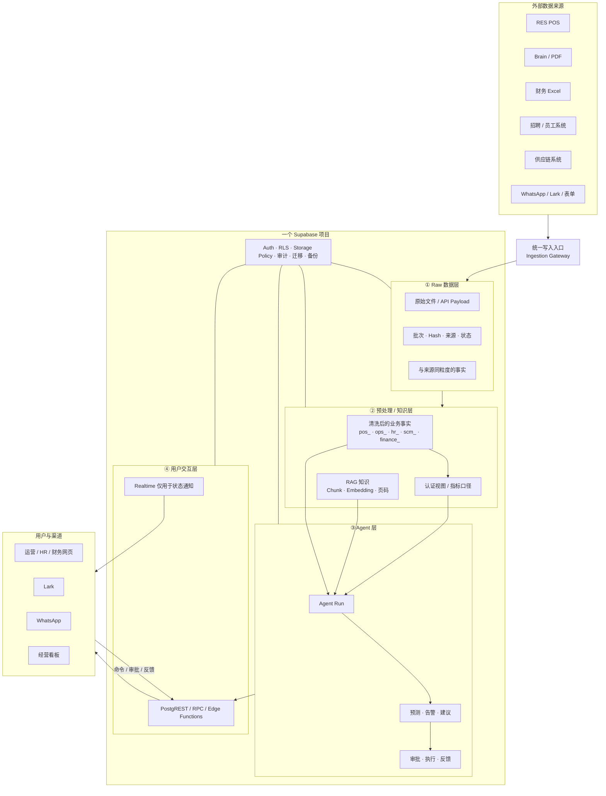
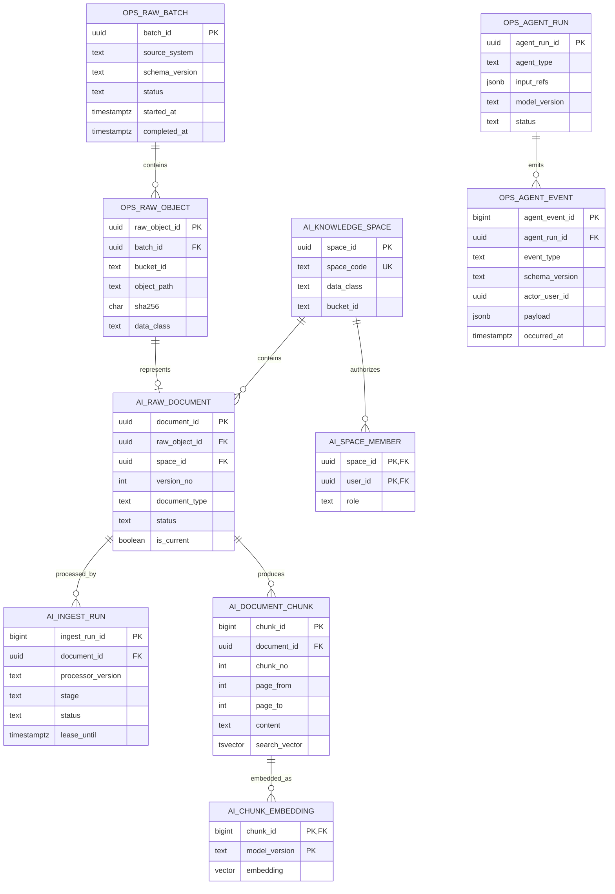
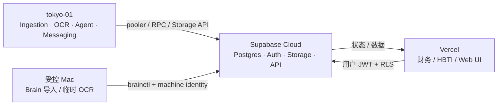

# HOT CRUSH Supabase 内部总体架构 v1（概念背景）

> 本文保留五层概念背景。当前可实施主蓝图已更新为
> `docs/database/hotcrush-supabase-implementation-blueprint-v2.md`；两者冲突时以 v2 为准。
>
> PDF/RAG 的详细实现和 CLI 验证保留在 `docs/database/supabase-rag-v1/`，作为本文附录，不再反过来主导总体架构。
>
> 状态：设计完成，未执行生产 DDL/DML，未上传 Brain 文件。

## 1. 一句话定义

HOT CRUSH 未来三年的数据平台不是 Fabric、数据湖或微服务集群，而是一个模块化的数据单体：

```text
一个 Supabase 项目
+ 一个统一写入入口
+ 一个 Raw 层
+ 一个预处理/知识层
+ 一个 Agent 层
+ 一个用户交互层
+ 一套贯穿所有层的权限、审计、备份和迁移治理
```

## 2. 对“一个写入源”的准确定义

“一个写入源”不是所有程序共用一个数据库超级账号，也不是把所有逻辑塞进一个脚本。它表示：

1. 外部数据只能通过统一写入入口进入 Supabase，不能由各应用随意直写业务表。
2. 每张表只有一个明确的唯一写者。
3. Raw 数据写入后不可原地覆盖，只能追加新批次或新版本。
4. 预处理结果只能由对应 processor 发布。
5. Agent 只能写 Agent 运行记录、建议和动作状态，不能直接修改来源事实。
6. 用户只提交命令、审批和反馈，不直接修改 Raw。

逻辑上是一个写入入口；物理上可以有多个来源适配器，但它们必须服从同一数据契约和表所有权。

## 3. 总体架构



治理不是第六个业务层，而是贯穿所有层的控制面。

## 4. Supabase 产品组件怎么放

| Supabase 组件 | 在本架构中的责任 | 不承担什么 |
|---|---|---|
| PostgreSQL | Raw 元数据、来源事实、预处理事实、指标视图、RAG 向量、Agent 状态 | 不存 PDF 二进制，不运行长时间 OCR |
| Storage | PDF、原始 API payload、Excel、OCR/版面解析产物 | 不承担业务查询和权限之外的业务逻辑 |
| Auth | 用户身份、会话、机器身份 | 不把 service-role 当普通机器身份 |
| RLS | 用户/角色/知识空间/门店范围的数据隔离 | 不能限制泄露的 BYPASSRLS/service-role |
| PostgREST / RPC | 用户和 worker 的受控读写入口 | 不允许客户端任意直写所有表 |
| Edge Functions | 签名上传、轻量鉴权、短请求编排 | 不运行长时间 OCR、Playwright 或本地模型 |
| Cron | 定时创建任务、清理超时租约、刷新小型物化结果 | 不承载长任务本身 |
| Realtime | 摄取进度、Agent 运行状态、审批状态通知 | 不订阅全部 POS/Raw 表 |
| Edge Secrets / 外部密钥管理 | API key 和 worker secret | 不把密钥放业务表、migration 或前端 |
| CLI | 本地栈、migration、测试、类型、函数、部署预览 | 不完成 PDF 分类、OCR 和 embedding |

## 5. 第一层：统一写入入口

### 5.1 来源适配器

统一写入入口下允许存在不同适配器：

| 适配器 | 来源 | 写入范围 | 唯一写者 |
|---|---|---|---|
| POS Adapter | RES POS | POS Raw/来源事实 | `res_api`，未来收进 Ingestion Gateway |
| Document Adapter | Brain/PDF | Storage + `ai_raw_document` | `brainctl` |
| Finance Importer | Excel/财务文件 | finance Raw/导入批次 | 财务导入程序 |
| HR Adapter | JobStreet/Boss/Lark/表单 | HR Raw/招聘事实 | HR worker |
| SCM Adapter | 供应链网站/表单 | SCM Raw/到货事实 | SCM worker |
| Message Adapter | WhatsApp/Lark | 消息收件与投递状态 | 消息 worker |

这些适配器不允许跨域写。例如 POS Adapter 不写财务分析结果，Agent 不写 POS 营收事实。

### 5.2 统一写入契约

每次写入至少携带：

- `source_system`
- `source_record_key` 或对象 hash
- `batch_id`
- `occurred_at`：业务发生时间
- `ingested_at`：进入 Supabase 的时间
- `writer_id`：哪个服务执行写入
- `schema_version`：来源契约版本
- `location_id`：当前唯一门店也必须保留
- `data_class`：C1–C4

## 6. 第二层：Raw 数据层

Raw 层的目标是“保留能够重建后续结果的原始证据”，不是把所有数据都塞进 JSONB。

### 6.1 Raw 层分为两类

#### A. 原始对象

适合放 Storage：

- PDF 原件
- Excel/CSV 原件
- API 原始响应压缩包
- OCR 页面图片
- 版面解析 JSON
- 外部系统导出文件

PostgreSQL 只保存对象元数据、hash、来源、批次、分类和处理状态。

#### B. 与来源同粒度的关系事实

适合直接进入 PostgreSQL：

- POS 订单、订单行、付款、退款
- 会员交易
- 商品时段销量
- 招聘申请事件
- 到货/库存事件
- 消息收发事件

这些可以经过类型转换和字段校验，但不能在 Raw 层混入利润率、预测、评分或经营结论。

### 6.2 Raw 层 V1 新增控制表

| 表 | 一行代表 | 目的 |
|---|---|---|
| `ops_raw_batch` | 一次来源导入/抓取批次 | 统一记录来源、契约版本、开始/结束、成功/失败和行数 |
| `ops_raw_object` | 一个 Storage 原始对象 | 保存 bucket/path/hash/大小/类型/分类，并关联 batch |

这两张表是所有 Raw 的共同血缘控制面；不会复制现有业务事实。

### 6.3 Raw 的不可变规则

- 相同 `source_system + source_record_key + source_version` 幂等。
- 文件按 `bucket + object_path + sha256` 对账。
- 原始对象不做原地替换；新文件建立新版本。
- 修正来源错误时写 correction 事件或新批次，不改写历史证据。
- Raw 不直接开放给普通用户和 Agent。

## 7. 第三层：预处理 / 知识层

这一层只有三种产物：结构化业务事实、认证指标、RAG 知识。

### 7.1 结构化业务事实

处理结果回到所属业务域，不建立通用 `processed_data` 大表：

| 业务域 | 前缀 | 内容 | 写者 |
|---|---|---|---|
| POS | `pos_` | 营收、订单行、付款、退款、单品销量、会员交易 | POS processor |
| 运营 | `ops_` | 复盘、排产、断货、预测、业务规则 | BakeryOps |
| HR | `hr_` | 候选人、申请、面试、Offer、员工事件 | HR processor |
| 供应链 | `scm_` | 供应商、订货、到货、库存事件 | SCM processor |
| 营销 | `mkt_` | 活动、奖励、触达、生日预约 | 营销服务 |
| 消息 | `msg_` | 会话、队列、投递、失败和重试 | 消息服务 |
| 财务 | `finance_` / `cost_card_` | 成本、费用、利润、现金流 | 财务网站/processor |
| AI | `ai_` | 文档知识、embedding、模型调用 | AI worker |

历史未加前缀的表不为整洁而批量改名；只有在结构本身需要修改时才按兼容迁移处理。

### 7.2 认证指标

Agent、看板和用户不应各自重新计算营业额、利润或转化率。指标通过 SQL view 暴露：

```text
v_ops_store_daily
v_ops_product_daily
v_ops_inventory_status
v_ops_member_summary
v_ops_hr_funnel
v_ops_finance_summary
```

这些是预计视图名称，不是已经存在的事实。正式命名前必须和现有 21 个视图对照，避免重复。

指标视图规则：

- 每个指标只有一个正式定义。
- 明确 grain、timezone、currency、来源、刷新时间和 owner。
- 默认普通 view；只有实测查询成本过高才使用 materialized view。
- 不提前建独立数据仓库或同步副本。

### 7.3 RAG 知识

RAG 只负责非结构化知识检索，不替代业务事实表。

V1 使用六张表：

| 表 | 一行代表 |
|---|---|
| `ai_knowledge_space` | 一个权限/保留策略边界 |
| `ai_space_member` | 一个用户在一个知识空间的角色 |
| `ai_raw_document` | 一个不可变 PDF 版本及其 Raw 对象引用 |
| `ai_ingest_run` | 一次解析、OCR、切块和 embedding 执行 |
| `ai_document_chunk` | 一个带页码的可检索文本块 |
| `ai_chunk_embedding` | 一个 chunk 的固定模型向量 |

为保持 V1 简单：

- 不单独拆 `document` 与 `document_version`；`ai_raw_document` 的每行就是一个不可变版本。
- 不建独立 page 表；页码范围直接保存在 chunk，逐页 OCR JSON 放 Storage。
- 不建 retrieval hit 明细表；先在既有 AI 调用日志中记录脱敏检索摘要。
- 后续只有出现逐页审核、复杂版本关系或严格检索审计时才拆表。

### 7.4 RAG 与结构化处理的分流

| 文档类型 | 主要结果 | 是否进入 RAG |
|---|---|---|
| SOP/制度/员工手册 | Chunk + embedding | 是 |
| 品牌手册 | OCR/视觉摘要 + Chunk | 是 |
| 合同 | 条款 Chunk | 仅法务空间 |
| 简历 | `hr_` 候选人结构化字段 | 默认否，必要时只用脱敏文本 |
| 工资单 | `hr_`/`finance_` 受限事实 | 否 |
| 发票/报销凭证 | `finance_` 费用事实 | 否 |
| 组织架构 | `hr_` 岗位/汇报关系 | 可选受限 RAG |

### 7.5 混合检索

```text
用户身份
  -> 可访问 knowledge_space
  -> current/ready 文档过滤
  -> PostgreSQL tsvector 关键词召回
  -> pgvector 语义召回
  -> RRF 合并
  -> 返回 chunk + document + page range
  -> Agent 带引用回答
```

初期使用 exact vector scan；只有 chunk 数量或实测 p95 延迟证明需要时才建 HNSW。

## 8. 第四层：Agent 层

Agent 层不是第二套业务数据库。它只保存：

- 一次 Agent 运行用了什么输入和模型。
- 产生了什么预测、异常、建议或动作请求。
- 谁审批、拒绝、执行或反馈。

### 8.1 Agent V1 新增表

| 表 | 一行代表 | 主要字段 |
|---|---|---|
| `ops_agent_run` | 一次 Agent 运行 | agent_type、input_refs、model、prompt_version、status、result_summary |
| `ops_agent_event` | Run 生命周期的一条追加事件 | event_type、actor、payload、occurred_at |

`ops_agent_event.event_type` 可包括：

```text
RECOMMENDATION_CREATED
APPROVAL_REQUESTED
APPROVED
REJECTED
EXECUTION_STARTED
EXECUTED
FAILED
FEEDBACK_RECORDED
```

V1 用一张追加事件表避免提前拆成建议、审批、执行、反馈四张表；只有当不同动作出现稳定、不同的强约束字段时再拆分。

### 8.2 Agent 的读写边界

Agent 可以：

- 读取认证指标视图。
- 读取获授权的 RAG chunk。
- 读取必要的结构化事实。
- 写 `ops_agent_run` 和 `ops_agent_event`。
- 提交待审批动作。

Agent 不可以：

- 修改 POS/财务/HR 来源事实。
- 绕过审批直接发券、排产、付款或联系候选人。
- 读取未获授权的 C3/C4 文档。
- 把 service-role key 暴露给浏览器或模型。

## 9. 第五层：用户交互层

### 9.1 用户入口

- BakeryOps 网页
- HR Agent 网页
- 财务网站
- HBTI/会员网页
- Lark Bot/审批
- WhatsApp Bot
- 管理层报表

### 9.2 Supabase API 边界

前端只使用 publishable/anon key + 用户 session，通过 RLS 访问允许的数据。

推荐 RPC：

| RPC | 调用者 | 作用 |
|---|---|---|
| `ops_register_raw_batch` | Ingestion Gateway | 建立 Raw 批次 |
| `ops_register_raw_object` | Ingestion Gateway | 登记 Storage 对象与 hash |
| `ai_claim_ingest_run` | AI worker | 带租约领取解析任务 |
| `ai_publish_document_chunks` | AI worker | 原子发布 chunk/embedding |
| `ai_search_knowledge` | 用户/Agent | 权限过滤后的混合检索 |
| `ops_start_agent_run` | Agent orchestrator | 建立运行记录 |
| `ops_append_agent_event` | Agent/用户 | 追加建议、审批、执行或反馈事件 |

RPC 是写入控制边界，不表示所有读取都必须包装成函数。简单、受 RLS 保护的查询仍可使用 PostgREST。

### 9.3 Realtime 范围

只考虑以下状态表：

- `ai_ingest_run`
- `ops_agent_run`
- `ops_agent_event`
- 必要的 `msg_` 队列状态

不把 POS、工资、Raw 对象或整个 public schema 加入 Realtime。

## 10. 贯穿层：身份与权限

### 10.1 人员角色

| 角色 | 业务数据 | C1 | C2 | C3 | C4 | 审批动作 |
|---|---|---:|---:|---:|---:|---:|
| Owner | 按治理授权 | 是 | 是 | 按需 | 按需 | 是 |
| Manager | 门店运营 | 是 | 部分 | 否 | 否 | 运营动作 |
| Staff | 本职数据 | 是 | 否 | 否 | 否 | 否 |
| HR | HR 数据 | 是 | HR 范围 | HR 范围 | 工资权限另授 | HR 动作 |
| Finance | 财务数据 | 是 | 财务范围 | 必要时 | 财务范围 | 财务动作 |
| Analyst | 脱敏/认证数据 | 是 | 经授权 | 默认否 | 否 | 否 |
| External Partner | 明确共享范围 | 部分 | 个别 | 否 | 否 | 否 |
| Machine Worker | 指定 RPC/空间 | 任务需要 | 任务需要 | 受限 | 受限 | 不具有人类审批权 |

### 10.2 RLS 规则

- 所有新增业务表启用 RLS；涉及敏感数据的表同时 FORCE RLS。
- Supabase Auth `auth.users` 是身份根；业务角色和 `location_id` 复用审计后选定的现有用户/角色表，不在本轮再造一套重复账号体系。
- RLS 中的 `auth.uid()` 使用可缓存写法，并为 policy 过滤列建索引。
- 知识访问以 `space_id + auth.uid()` 判断。
- 业务访问以角色、`location_id` 和数据域判断。
- Storage policy 使用 bucket + 路径首段空间 ID，与数据库 RLS 使用同一权限来源。
- `service_role` 具有 BYPASSRLS，不能作为普通 worker 的安全边界。

## 11. 贯穿层：Storage 架构

### 11.1 预计 bucket

| Bucket | 内容 | 级别 |
|---|---|---|
| `raw-business-private` | POS API payload、Excel/CSV 原件、普通系统导出 | C1/C2 |
| `kb-internal` | SOP、制度、品牌和培训知识 | C1 |
| `hr-recruiting-private` | 简历、面试、Offer、员工档案 | C3 |
| `hr-payroll-private` | 工资和薪酬材料 | C4 |
| `finance-private` | 发票、报销、银行与财务原件 | C3/C4 |
| `legal-private` | 合同、授权和法律资料 | C2/C3 |

全部是 private bucket。

### 11.2 对象路径

业务 Raw：

```text
<source_system>/<yyyy>/<mm>/<batch_id>/<raw_object_id>.<ext>
```

PDF：

```text
<space_id>/<document_id>/<version_no>/original.pdf
<space_id>/<document_id>/<version_no>/artifacts/pages.json
<space_id>/<document_id>/<version_no>/artifacts/ocr.json
```

路径不含姓名、手机号、身份证号或原文件名。

## 12. 贯穿层：任务与外部 worker

长任务运行在 tokyo-01 或受控 Mac：

- Playwright/RES 抓取
- PDF 下载与 OCR
- 表格/版面/视觉解析
- embedding
- 长时间 Agent 工作流
- WhatsApp/Lark 发送

Supabase 只保存任务、租约、状态、结果和审计。

任务领取使用：

```text
PENDING
  -> worker 通过 RPC + FOR UPDATE SKIP LOCKED 获取租约
  -> RUNNING
  -> SUCCEEDED / REVIEW_REQUIRED / FAILED
  -> 超时租约回到 RETRY
```

当前规模不必先引入独立 Kafka、Airflow 或 Temporal。

## 13. 贯穿层：索引与性能

- 内部顺序记录优先 `bigint generated always as identity`。
- 需要跨系统暴露的文档/批次 ID 使用 UUID。
- 每个外键列显式建索引。
- 待处理任务使用 `WHERE status IN ('PENDING','RETRY')` partial index。
- RAG 使用 `tsvector + GIN`；向量初期 exact scan。
- 只查询当前文档时，在 `ai_raw_document` 上用 `WHERE status='READY' AND is_current` partial index。
- Vercel/Serverless 和短连接 worker 使用 transaction pooler。
- 不提前做分区；只有单表规模、维护窗口或查询计划证明需要时再做。

## 14. 贯穿层：审计、备份和可恢复性

### 必须保留的审计

- 谁/哪个服务写入 Raw。
- 哪个 processor 版本生成预处理结果。
- 哪个模型和 prompt 生成 Agent 结果。
- 谁审批、拒绝或执行动作。
- 哪个知识 chunk 被用于回答。

### 恢复组成

```text
数据库备份
+ Storage 对象与 manifest
+ Git 中的 migration
+ Worker/processor 版本
+ Secret 的独立恢复流程
```

数据库备份不自动等于 Storage 原件备份；必须另做 Storage manifest 和定期导出/恢复演练。

## 15. V1 预计新增的核心表

经过自动处理账本复核，V2 核心新增 11 张表：

| 层 | 表 |
|---|---|
| Raw 控制 | `ops_raw_batch`、`ops_raw_object` |
| 处理控制 | `ops_processing_run` |
| RAG | `ai_knowledge_space`、`ai_space_member`、`ai_raw_document`、`ai_ingest_run`、`ai_document_chunk`、`ai_chunk_embedding` |
| Agent | `ops_agent_run`、`ops_agent_event` |

其他要求：

- 复用并修正现有 `ai_call_log`，不再新建第二张模型调用日志。
- 现有 `pipeline_health` 只作运行健康摘要；不能替代逐批次、逐 processor 的 `ops_processing_run`。
- 预处理业务结果写入现有业务域或新增明确的域表，不新建通用 `processed_result`。
- 指标优先建 view，不先建事实副本。

## 16. 核心关系图



业务域的 `pos_`、`ops_`、`hr_`、`scm_`、`mkt_`、`finance_` 等表位于 Raw 来源事实与 Agent 之间，因为数量较多且已经存在，没有全部塞进这张核心控制图。

## 17. 三条完整数据流

### 17.1 POS 到经营建议

```text
RES POS
-> POS Adapter
-> ops_raw_batch
-> POS 来源事实
-> 清洗/约束
-> pos_/ops_ 业务事实
-> v_ops_store_daily
-> Agent Run
-> 建议事件
-> 店长审批
-> 执行/反馈事件
```

### 17.2 PDF 到 RAG 回答

```text
Brain PDF
-> brainctl 分类确认
-> 私有 Storage
-> ops_raw_object
-> ai_raw_document
-> ai_ingest_run
-> 外部 worker OCR/切块/embedding
-> ai_document_chunk + ai_chunk_embedding
-> ai_search_knowledge
-> Agent 带页码回答
-> 用户界面
```

### 17.3 工资单到财务/HR 事实

```text
工资 PDF
-> hr-payroll-private
-> Raw 元数据
-> 受控 OCR/表格抽取
-> 人工复核
-> hr_/finance_ 受限事实
-> 财务/HR 受限视图
```

工资单不会进入通用 RAG。

## 18. 部署拓扑



只有 Supabase 是数据真源；tokyo-01、Vercel 和 Mac 都是计算或交互节点。

## 19. 实施顺序

### Phase 0：收拢写入与迁移治理

- 确认 Source 项目是生产真源，R6 Green 只做无 PII 演练。
- 建立唯一 Supabase migration 目录和 CLI 基线。
- 列出每张现有表的唯一写者。
- 停止通用 `postgres`/service-role 直写扩散。

### Phase 1：Raw 控制层

- 建 `ops_raw_batch`、`ops_raw_object`。
- POS/PDF/Excel 新写入都关联 batch/hash/source。
- 建 Storage bucket 和 policy。

### Phase 2：预处理与 RAG

- 先整理认证指标 view。
- 建六张最小 RAG 表和 pgvector。
- 仅导入 C1 试点文件。

### Phase 3：Agent 层

- 建 `ops_agent_run`、`ops_agent_event`。
- Agent 改为只读认证视图/RAG、写建议事件。
- 所有有副作用动作先审批。

### Phase 4：用户闭环

- UI/Lark/WhatsApp 展示运行状态、证据、建议和审批。
- 记录执行结果和反馈。
- 根据反馈评估模型与规则。

## 20. 明确不建设的内容

当前不建设：

- Microsoft Fabric / OneLake
- 独立数据仓库或第二套生产数据库
- Kafka/CDC 总线
- 全表 Realtime
- 独立向量数据库
- 提前 HNSW
- 大规模表分区
- 十多个 PostgreSQL schema
- 每个 Agent 一套独立数据库
- 把所有 PDF 全部 embedding

这些能力只有在真实负载、合规或恢复边界改变后重新评估。

## 21. 最终验收标准

- 所有数据都能沿“来源 → Raw → 预处理 → Agent → 用户”追踪。
- 每张表只有一个唯一写者。
- Raw 可重放，预处理结果可重建。
- 用户和 Agent 都不能越权读取 C3/C4。
- Agent 不直接修改 L1/业务事实。
- PDF 回答必须带文档和页码引用。
- 生产 migration 先在本地和 R6 Green 重放，再由人执行生产变更。
- 单店规模下不增加未经数据证明的基础设施。
