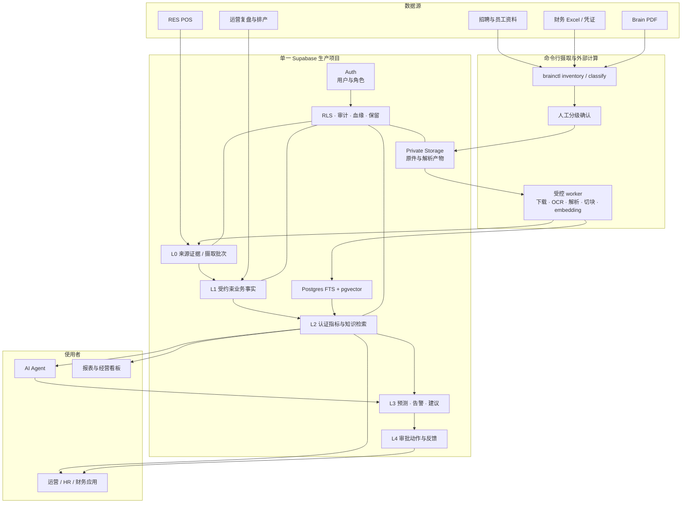
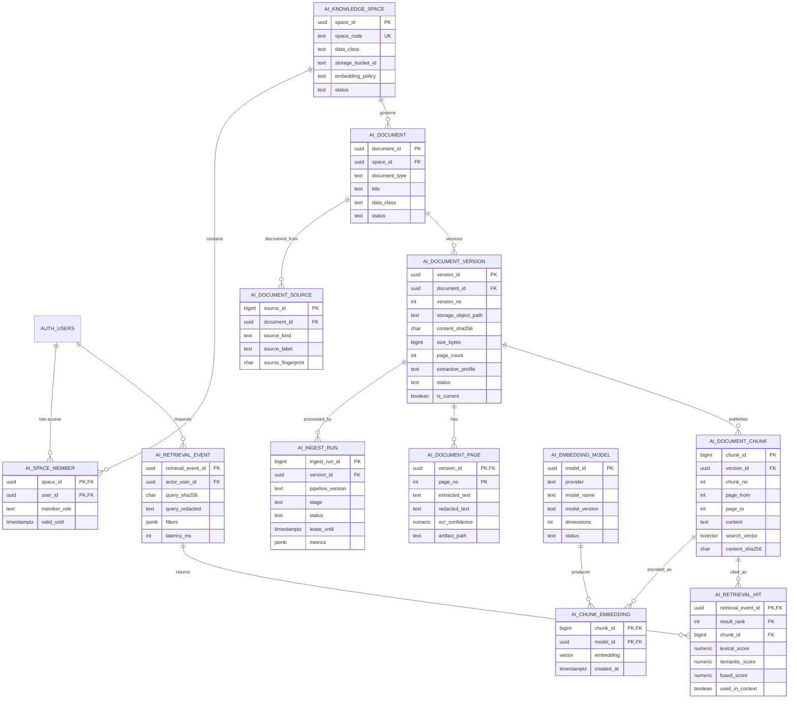
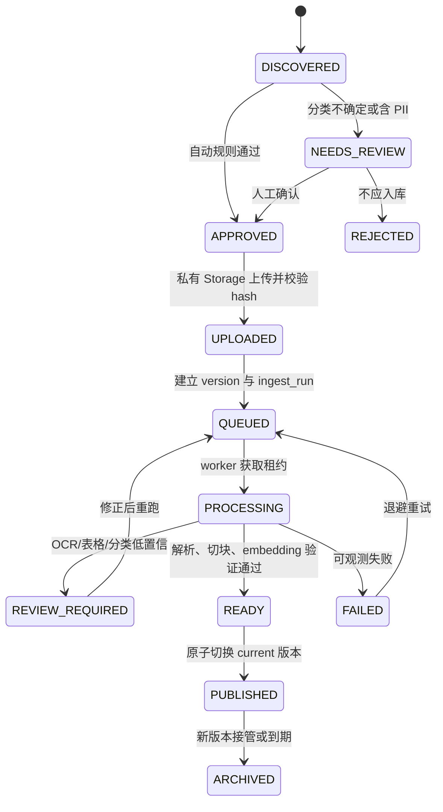

# HOT CRUSH 单项目 Supabase 分级数据架构与 PDF/RAG 蓝图 v1

> 状态：设计基线，尚未执行生产 DDL/DML，尚未上传 Brain 文件。
>
> 日期：2026-08-20
>
> 定位修正：本文保留 PDF 盘点、风险和早期 12 表设计历史，不作为实施表结构。
> 当前六表 RAG、自动摄取状态机和迁移方案以
> `docs/database/hotcrush-supabase-implementation-blueprint-v2.md` 为准。

## 1. 结论

当前规模下，采用“一个生产 Supabase 项目 + 外部轻量摄取 worker”可行，也比引入 Fabric、独立数仓或独立向量数据库更合适。

这里必须区分两个结论：

- 整条流程可以做到“全部通过命令行触发和验收”。
- 整条流程不能只靠 Supabase 官方 CLI 完成。PDF 盘点、分类、OCR、版面解析、切块和 embedding 需要项目自有 CLI 与外部 worker；Supabase CLI 负责本地栈、迁移、测试、类型、函数、密钥和 Storage 操作。

Supabase 是统一数据与治理平面，不是所有计算都应运行在 Supabase 内。长时间 OCR、视觉解析和本地模型推理继续运行在 tokyo-01 或受控 Mac worker，结果和状态统一写回 Supabase。

## 2. 前提检查

### 已确认事实

- 现有 Source 生产库是 PostgreSQL 17.6，约 97.2 MiB；`public` 中有 130 张表、21 个视图。
- 当前生产库没有启用 `vector` 扩展，也没有把业务表加入 Realtime publication。
- 当前只有一家门店，数据量不足以证明需要 Fabric、CDC、独立 OLAP 或数据库分片。
- Brain 中盘点到 165 份 PDF，逻辑大小约 68.45 MiB，包含制度、简历、工资、凭证、合同、组织架构和品牌材料等不同安全等级与版式。
- 仓库已有 LightRAG 服务，但其知识、图和向量目前保存在本机 JSON/GraphML 文件中，embedding 固定为 1536 维并通过 OpenRouter 生成；它不是 Supabase 真源。
- 仓库根目录的 Supabase CLI 临时元数据当前链接到 `hotcrush-core-r6-green`，不是 Source 生产库。
- 本机没有全局 `supabase` 命令，但 npm 缓存中的 Supabase CLI 2.115.0 已完成本地验证；Docker 可用。

### 合理推测

- 165 份 PDF 完成去重和切块后，初始 chunk 数大概率远低于 100,000；因此 V1 先做精确向量扫描，通常比提前维护 HNSW 更合理。
- 现有一台外部 worker 足以承载首批 OCR 与 embedding，但真实吞吐需用 20 份代表文档测量。
- BGE-M3 的 1024 维向量适合中英混合材料，属于候选方案，不是已通过 HOT CRUSH 数据集证明的最佳模型。

### 暂时无法验证

- 各岗位应访问哪些 C2/C3 文档，现有 `auth.users` 如何映射到管理层、财务、HR、门店和外部伙伴。
- 简历、工资、合同和凭证的法定保留期与删除审批规则。
- OCR、表格抽取和 embedding 模型在实际 Brain 样本上的准确率、成本与吞吐。
- Source 生产项目是否应立即接管根目录 Supabase CLI 链接；在迁移所有权确定前不得重链或执行 `db push`。

## 3. 目标架构



### 分级含义

| 层级 | 含义 | AI 权限 | 示例 |
|---|---|---|---|
| L0 | 原始来源证据、文件版本、批次与解析状态 | 不直接用于回答 | PDF 原件、POS 抓取批次、OCR 产物 |
| L1 | 有主键、约束、粒度和单写者的业务事实 | 只读 | 销售、库存、候选人、员工、费用事实 |
| L2 | 经定义和验证的指标、知识块、检索函数 | 主要读取层 | 门店日指标、SOP chunk、授权后的混合检索 |
| L3 | 模型输出、预测、异常和建议 | 可写，但必须保留模型与输入版本 | 销量预测、缺货预警、排产建议 |
| L4 | 人工审批、实际动作和反馈 | 只能提出或记录，不可绕过审批 | 已批准排产、推送、处理结果、反馈 |

核心约束：AI 不直接修改 L1 事实；AI 结果写入 L3，人工或规则审批后才进入 L4。

## 4. Supabase 内部边界

继续遵守当前项目的 `public` schema + 域前缀约定，不做美容式 schema 拆分：

- `pos_`：RES/POS 来源事实，由 `res_api` 写。
- `ops_`：运营复盘、预测、排产和 Agent 建议，由 BakeryOps 写。
- `hr_`：招聘和员工业务事实。
- `scm_`：供应链事实。
- `mkt_`：营销与活动。
- `msg_`：消息通道和投递审计。
- `ai_`：模型调用、知识治理、chunk、embedding 和检索审计。
- `finance_`、`cost_card_`、`app_`：继续由财务网站/账号治理所有，不由本次 RAG 重构改写。

本次只新增 `ai_` 知识域，不复制 POS、HR、财务事实到一套“AI 表”。RAG 只保存文档版本、可检索文本、向量和检索证据；工资、费用、候选人等结构化结果应写回各自受控业务域，而不是塞进 chunk JSON。

## 5. PDF 数据分级

| 级别 | 内容 | Storage | 允许 OCR/结构化 | 允许 embedding/RAG |
|---|---|---|---|---|
| C1 内部 | SOP、员工手册、品牌规范、公开培训材料 | `kb-internal` | 是 | 是，混合检索 |
| C2 受限 | 合同模板、供应链手册、内部经营资料 | `legal-private` / 对应私有 bucket | 是 | 仅授权空间 |
| C3 个人机密 | 简历、面试材料、员工档案 | `hr-recruiting-private` | 是，优先结构化与脱敏 | 默认禁止；仅脱敏文本可例外 |
| C4 密封 | 工资、银行信息、报销凭证、身份证件 | `hr-payroll-private` / `finance-private` | 仅受控任务 | 禁止通用 embedding 和问答 |

不存在“先全部上传到一个 bucket，后面再分类”的安全捷径。未分类文件先停留在本地 manifest；确认安全等级后才进入对应私有 bucket。

Storage 对象路径必须不含姓名、手机号或原文件名：

```text
<space_id>/<document_id>/<version_no>/original.pdf
```

原文件名只作为受 RLS 保护的元数据保存。上传前计算 SHA-256；同一安全空间内相同 hash 只保留一个逻辑版本，跨安全空间不得共享物理对象。

## 6. PDF/RAG 数据结构图



### 表粒度与所有权

| 表 | 一行代表 | 唯一写者 |
|---|---|---|
| `ai_knowledge_space` | 一个权限和保留策略边界 | 知识库管理员 |
| `ai_space_member` | 一个用户对一个空间的角色 | 权限管理员 |
| `ai_document` | 一个逻辑文档 | 摄取控制面 |
| `ai_document_source` | 一个被发现的来源位置或别名 | `brainctl inventory` |
| `ai_document_version` | 一个不可变文件版本 | 摄取控制面 |
| `ai_ingest_run` | 一次可重试的管线执行 | 摄取 worker |
| `ai_document_page` | 一个版本的一页解析结果 | 摄取 worker |
| `ai_document_chunk` | 一个可引用、可检索文本块 | 摄取 worker |
| `ai_embedding_model` | 一个冻结维度与版本的 embedding 模型 | AI 管理员 |
| `ai_chunk_embedding` | 一个 chunk 在一个模型下的向量 | 摄取 worker |
| `ai_retrieval_event` | 一次权限感知检索 | RAG API |
| `ai_retrieval_hit` | 一次检索返回的一条证据 | RAG API |

## 7. 关键数据库约束

1. 所有新增表必须有主键、表注释、列级必要约束、外键索引和 RLS。
2. `ai_document_version` 必须满足 `UNIQUE(document_id, version_no)`；同一文档只有一个 `is_current = true` 的已发布版本。
3. `content_sha256` 与 `size_bytes` 在上传前计算；同一空间的重复内容不得重复建立当前版本。
4. `storage_object_path` 的首段必须等于 `space_id`，对象名不得包含原文件名。
5. `ai_document_chunk` 只允许引用 `READY/PUBLISHED` 前的受控版本；发布时一次性切换版本状态，避免半成品被检索。
6. `ai_chunk_embedding.embedding` V1 固定为 `extensions.vector(1024)`。更换维度必须新增迁移并重建 embedding，不在同一列混放不同维度。
7. `ai_ingest_run` 同一版本最多只有一个 `PENDING/RUNNING` 行；worker 使用 `FOR UPDATE SKIP LOCKED` 和租约领取任务。
8. C4 空间禁止创建 page text、chunk 和 embedding；C3 默认禁止，只有脱敏策略明确时才允许 `redacted_text` 进入 chunk。
9. 检索必须先确定调用者可访问的 `space_id`，再执行全文和向量排名；不得先跨库检索后在应用层删结果。
10. `query_text` 默认只保存 SHA-256 与脱敏版本，不把工资、姓名、手机号等原始查询写入通用日志。

## 8. 权限模型

空间角色建议固定为：

- `VIEWER`：查看已发布文档和检索结果。
- `EDITOR`：上传、维护元数据和发起重处理。
- `INGESTOR`：机器身份，领取任务、读取原件、写 page/chunk/embedding；不能管理成员。
- `ADMIN`：管理空间、成员、保留策略和发布。

所有业务访问通过 Supabase Auth 的 `auth.uid()` 与 `ai_space_member` 判断。浏览器不得持有 service-role key。

需要直接指出：`service_role` 具有 `BYPASSRLS`，RLS 无法限制泄露的 service-role key。新 worker 应使用独立机器身份和受限 RPC/Storage policy；旧代码中的通用 service-role 只能按阶段收敛，不能把“已启用 RLS”误当作已经实现最小权限。

Storage 和表必须执行同一权限判断：bucket 是第一道隔离，路径首段 `space_id` 是第二道隔离，`storage.objects` policy 与业务表 RLS 是第三道隔离。

## 9. 摄取状态机



解析策略必须按文档类型分流：

- 制度/SOP：优先保留标题层级，按章节切块。
- 扫描简历：OCR 后抽取候选人字段；默认不进入通用 RAG。
- 工资/费用/凭证：抽取到受控结构化事实；原文不做通用问答。
- 品牌手册：逐页 OCR + 视觉摘要，引用必须保留页码。
- 组织架构：抽取人员/岗位/汇报关系，低置信关系进入人工复核。
- 合同：按条款切块，仅法务空间可检索。

## 10. 检索设计

V1 使用权限感知的混合检索：

1. 根据 `auth.uid()` 取允许访问的空间。
2. 只选择 `PUBLISHED + is_current` 版本。
3. `tsvector` 做关键词检索；`pgvector` 用 cosine distance 做语义检索。
4. 两组候选通过 Reciprocal Rank Fusion 合并，而不是直接相加不可比的原始分数。
5. 返回 `document_id/version_id/page_from/page_to/chunk_id`，回答必须附页码引用。
6. 将候选、最终上下文、模型版本和延迟写入检索审计。

中文全文检索需要单独验收。PostgreSQL `simple` 配置对英文和马来文较直接，但不等于高质量中文分词；首版可依赖语义检索补足，若中文精确关键词召回不足，再评估可用扩展或受控的 n-gram/trigram 路径，不能默认官方示例在中文上同样有效。

初期不建 HNSW。达到约 100,000 个可检索 chunk，或基准测试证明 p95 延迟不达标后，再按实际距离算子创建 HNSW，并同时测召回率、内存和写入成本。

## 11. 现有 LightRAG 的处理

不能让本机 LightRAG 和 Supabase pgvector 同时充当知识真源。建议：

1. 立即把现有 LightRAG 定义为“待迁移的派生索引”，不再承诺其内容是完整或可审计真源。
2. 导出并盘点现有 21 份 full docs；先识别是否混有员工或候选人信息。
3. 只迁移合规的 C1 运营复盘/SOP；C3 内容必须脱敏或舍弃。
4. 使用新模型重新 embedding，不直接把 1536 维旧向量复制到 1024 维表。
5. 新 Supabase 混合检索通过离线评测后，切换 BakeryOps 查询调用点。
6. 保留短期只读回滚窗口，随后删除 LightRAG 本机派生索引；原始业务事实仍在业务表中。

## 12. 分阶段重构

### Phase 0：迁移治理先行

- 确认 Source 生产项目 ref、R6 Green 的演练用途和唯一迁移目录。
- 采用 Supabase 自带 `supabase_migrations.schema_migrations`；冻结四个仓库各自随意执行编号 SQL 的做法。
- 从 Source 生产库建立只读基线，不把旧 R6 100+ 表包推回生产。
- 为 `mkt_birthday_profile`、`mkt_birthday_reservation` 补 RLS 的修复单独排期，不夹进 RAG 大迁移。

验收：本地 `db reset` 可从零重建，migration list 与目标项目一致，所有生产写入仍须人工执行。

### Phase 1：知识治理基座

- 启用 `vector` 扩展。
- 建五个私有 bucket、12 张 `ai_` 表、RLS、Storage policy、索引和注释。
- 建立机器身份、任务租约和幂等约束。
- 暂不开启面向用户的 RAG。

验收：pgTAP 覆盖跨空间拒绝、C4 禁止 embedding、重复 hash、单 current 版本和非法对象路径。

### Phase 2：C1 试点

- 仅导入 10–20 份 SOP/员工手册/品牌材料。
- 对有文本、扫描件和图像主导 PDF 各取样。
- 建 30–50 个真实问题的 golden set，比较关键词、向量和混合检索。

验收：引用页码正确；未授权用户返回 0 行；OCR/检索失败可重试且无重复版本。

### Phase 3：结构化文档管线

- 简历、组织架构、工资、费用和合同分别进入专用解析器。
- 结构化结果进入 `hr_`/`finance_` 等业务域；RAG 仅保留允许检索的脱敏文本。
- C3/C4 必须经过人工抽样和保留期确认。

### Phase 4：应用切换与 LightRAG 退役

- BakeryOps 的知识查询改为 Supabase RPC。
- Agent 只读取 L2 检索结果，回答强制引用。
- 对比新旧结果一段时间后停止 LightRAG 写入并清理派生索引。

### Phase 5：按测量结果扩容

只有满足明确触发条件才增加 HNSW、分析副本、CDC 或独立数仓，不因为产品菜单里存在这些功能就启用。

## 13. 成功标准

- 任何本地开发者只用文档中的 CLI 命令即可重建本地 Supabase、跑迁移、pgTAP、lint、advisor 和类型生成。
- 任何文档都有来源、hash、版本、页码、空间、分类、处理状态和唯一当前版本。
- C4 文档在数据库中没有 chunk/embedding；C3 默认同样如此。
- 未授权用户无法通过表、RPC 或 Storage 路径读取对象；service-role 不进入浏览器或通用客户端。
- 20 份试点文件可重复摄取，重跑不产生重复版本或重复 chunk。
- 真实问题集能回溯到页码，且回答未引用证据时被视为失败。
- 生产迁移可先在本地和 R6 Green 重放；生产只执行经过人工批准的 migration，不使用 `db reset --linked`。

## 14. 参考依据

- [Supabase CLI 本地开发](https://supabase.com/docs/guides/local-development/cli/getting-started)
- [Supabase CLI 工作流](https://supabase.com/docs/guides/local-development/cli-workflows)
- [Supabase Hybrid Search](https://supabase.com/docs/guides/ai/hybrid-search)
- [Supabase Semantic Search / pgvector](https://supabase.com/docs/guides/ai/semantic-search)
- [Supabase CLI Storage](https://supabase.com/docs/reference/cli/supabase-storage)
- [Supabase 数据库测试与 lint](https://supabase.com/docs/guides/local-development/cli/testing-and-linting)
